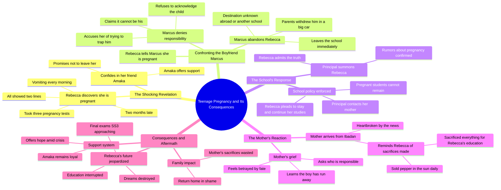

# Rebecca Episode 1: Pregnant After Just the Tip

> 🌐 **Read this in:** [English](../../en/2026-09/tiktok-transcript-video-c218.md) · **中文**

> **Creator:** [@storysthetic_](https://www.tiktok.com/@storysthetic_) · **Views:** 358.6K · **Posted:** 2026-09-08 · **Niche:** entertainment
>
> **TL;DR:** The hook uses a raw, shocking denial that immediately raises questions and hooks the viewer.

[Watch original video →](https://vm.tiktok.com/ZN82UMbWU/)

## Why This Went Viral

## Hook（前3秒）
- **逐字开场白：** “你说你怀孕了是什么意思？就蹭了一下，我都没射。”
- **钩子模式：** 大胆声明 + 冲击性对话（否认与现实之间的反差）。
- **为何能阻止滑动：** 它将观众直接抛入一场争吵中，用赤裸裸、毫不掩饰的否认——瞬间制造出“等等，什么？”的时刻。禁忌话题和直白的语言在2秒内激发情绪反应（震惊、评判、好奇），让人无法不看到结果就划走。

## 情绪节奏
1. **震惊/难以置信** — 开场争吵：“就蹭了一下”奠定了挑衅、紧张的氛围。
2. **焦虑** — 丽贝卡向阿玛卡坦白：“我测了三次……我已经两个月没来了。”通过身体症状逐步累积恐惧感。
3. **希望/宽慰（虚假的）** — 阿玛卡的安慰：“那他会负责任的……他爱你。”制造了一个虚假的舒适高峰。
4. **紧张升级** — 与马库斯对峙：“你想套住我。”反转：男友否认并抛弃了她。
5. **绝望** — 丽贝卡得知马库斯跑了：“他把所有东西都收拾好，走了。”情绪跌入谷底；观众感受到她的孤立无援。
6. **共鸣/同情** — 阿玛卡的忠诚：“不管发生什么，我不会离开你，丽贝卡。”一个短暂的情感锚点。
7. **高潮——公开羞辱** — 校长的开除决定：“怀孕的女孩不能留在这里。”体制与她为敌。
8. **悲剧性收尾** — 母亲的到来：“我在太阳底下卖辣椒……就是为了不让你像我一样。”高潮在此落地——代际牺牲遇上背叛，带来让观众愿意分享的沉重一击。

## 关键词密度
- **“怀孕”**（6次）— 驱动核心冲突；对剧情类内容具有高搜索/算法相关性。
- **“对不起”**（4次）— 情感牵引；传递内疚、羞耻和同情——引发共情驱动的互动。
- **“妈妈/妈咪”**（5次）— 与家庭牺牲挂钩；情感共鸣强烈，尤其对非洲侨民受众。
- **“走了”**（3次）— 强化被抛弃感；制造观众切身体会的失落感。
- **“蹭”**（1次）— 挑衅性、禁忌感；驱动初始好奇心和评论区争论（高互动）。
- **“卖”**（2次）— 锚定牺牲；让母亲的痛苦变得具体可感、易于分享。
- **“学校”**（4次）— 熟悉的场景；将传播范围扩大到小众受众之外（教育、少女怀孕话题）。

## 为何能病毒式传播
- **普世禁忌 + 特定文化背景** — 少女怀孕、否认和父母牺牲在全球范围内引发共鸣，但尼日利亚寄宿学校的设定（SS3、伊巴丹、“Chineke”）赋予其真实的特殊性，驱动小众病毒式传播和跨文化好奇心。
- **引战式对话** — 像“就蹭了一下”和“你想套住我”这样的台词刻意设计来激发愤怒和争论。观众涌入评论区发表判断、个人故事和辩护——推高互动信号。
- **60秒内的情绪过山车** — 剧本将完整的悲剧弧线（希望 → 背叛 → 羞辱 → 牺牲）压缩到一个片段中。观众反复观看以捕捉情绪转变，并将其作为“警示故事”或“催泪弹”分享。
- **可共鸣的原型人物** — “否认的男友”、“忠诚的闺蜜”、“严厉的校长”和“含辛茹苦的母亲”一眼就能认出。观众@朋友（“这就是我们”）或作为道德教训分享，成倍扩大传播。
- **开放式悬念结尾** — “来，我们回家”让未来悬而未决。观众评论“第二部？”创作者跟进，形成连载式互动，让原视频持续传播。

## 你可以借鉴什么
1. **从危机中间开始，而不是从头开始** — 用最具爆炸性的对话开场。不要铺垫场景；直接把观众扔进争吵中，让他们通过情绪反应拼凑出背景。
2. **在反转前使用“虚假希望”节拍** — 让一个配角在背叛发生前提供安慰（“他爱你”）。这让情绪崩塌更猛烈，片段更值得反复观看。
3. **以父母的牺牲台词收尾** — 最可分享的时刻是当配角（母亲）说出重新定义整个故事利害关系的一句话。精心打磨一句概括代价的台词（“我在太阳底下卖辣椒”）——这就是观众在评论和标题中引用的那句话。

## Mind Map

## Full Transcript (Generated by [TokTranscript](https://toktranscript.com/?utm_source=github&utm_medium=breakdown&utm_campaign=tool_attribution))

> 📝 Transcripts on this page are auto-generated and show the first 60%. Want to transcribe any TikTok in 30 seconds and get the full version? [Try TokTranscript free →](https://toktranscript.com/?utm_source=github&utm_medium=breakdown&utm_campaign=transcript_cta)

What do you mean you're pregnant? It was just the tip and I didn't even come. So how come you don't mean that? Rebecca, what is it? You've been shaking since prep time, Amaka. I did the test three times, two lines every time. Ah, Rebecca, no. Are you sure? Maybe the test is. I'm 2 months late, Amaka. I've been vomiting every morning. I know my body. Chineke, what are you going to do? I don't know. I don't know anything anymore. Is it, is it Marcus? Then he will take responsibility. He has to. You think so? I know. So tell him tomorrow. He loves you. I need to talk to you. It's important. Rebecca, my baby. What is it? You look serious. I'm pregnant. You're what? I'm pregnant. It's yours. Two months. Mine. How is it mine? What do you mean how? There's nobody else you know that. Don't start this nonsense. You want to trap me. I'm carrying your child. I'm not trying to trap anybody. Keep your voice down. I don't know what you did or who you were with. This thing isn't my business. Don't call my name. Don't come near me. Rebecca, Rebecca, what is it? What is it? He's gone. His parents came this morning with a big car. They withdrew him from the school. He has packed everything, gone. Gone where? Nobody knows. Some say abroad. Some say another school in Abuja. What am I going to do, Amaka? What am I going to tell my mother. She sold everything to put me here. Everything. We'll think of something. You're not alone. Do you hear me? Whatever happens, I'm not leaving you, Rebecca. DM me. The principal want

*[Read the full transcript on TokTranscript →](https://toktranscript.com/plaza/tiktok-transcript-video-c218?utm_source=github&utm_medium=breakdown&utm_campaign=transcript_full)*

## Browse More

- All [entertainment](../../by-niche/zh-CN/entertainment.md) breakdowns
- All [Shocking denial](../../by-pattern/zh-CN/hook-shocking-denial.md) examples

## Video Info

| | |
|---|---|
| Creator | [@storysthetic_](https://www.tiktok.com/@storysthetic_) |
| Original video | [https://vm.tiktok.com/ZN82UMbWU/](https://vm.tiktok.com/ZN82UMbWU/) |
| Original title | 𝐑𝐄𝐁𝐄𝐂𝐂𝐀   | 𝐄𝐩𝐢𝐬𝐨𝐝𝐞 𝟏  𝐓𝐡𝐢𝐬 𝐢𝐬 𝐚 𝐟𝐢𝐜𝐭𝐢𝐨𝐧𝐚𝐥 𝐬𝐭𝐨𝐫𝐲 𝐜𝐫𝐞𝐚𝐭𝐞𝐝 𝐟𝐨𝐫 𝐞𝐧𝐭𝐞𝐫𝐭𝐚𝐢... |
| Views | 358.6K (358600) |
| Posted | 2026-09-08 |
| Duration | 0s |
| Niche | `entertainment` |
| Hook pattern | `Shocking denial` |
| Original language | `en` (this page translated by AI) |
| Available languages | en, zh-CN |
| Generated | 2026-09-09 by [TokTranscript](https://toktranscript.com/) |

---

*This breakdown is for educational analysis under fair use. Original video © [@storysthetic_](https://www.tiktok.com/@storysthetic_). All transcripts are auto-generated and may contain errors.*

*Want to analyze your own TikToks like this? [免费 TikTok 文稿生成器 →](https://toktranscript.com/viral-breakdown?utm_source=github&utm_medium=breakdown&utm_campaign=footer_cta)*