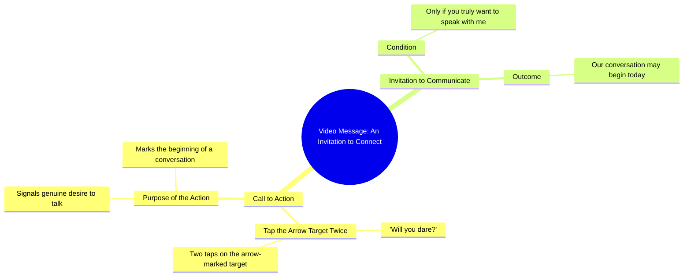

# Will You Dare Touch the Arrow Target Twice

> 🌐 **Read this in:** [English](../../en/2026-10/tiktok-transcript-10m-views-163k-reactions-03045658506-1e58.md) · **中文**

> **Creator:** [@03045658506](https://www.tiktok.com/@03045658506) · **Views:** 4.1M · **Posted:** 2026-10-03 · **Niche:** other
>
> **TL;DR:** The hook directly challenges the viewer's courage, compelling them to engage.

[Watch original video →](https://www.facebook.com/share/r/1FvTbg8Z3M/)

## Why This Went Viral

## 钩子（前3秒）
- **逐字开场白：** “क्या आप हिम्मत करेंगे?”（“你敢吗？”）紧接着“इस तीर वाले निसान पर दो बार टच करके देखो”（“在这个带箭头的标记上触摸两次试试”）。
- **钩子模式：** 直接挑战/激将 + 好奇心缺口（“क्या आप हिम्मत करेंगे?”）结合指令式命令（“टच करके देखो”）。
- **为什么能阻止滑动：** 它在一秒内将被动观看者转变为主动参与者。激将触发自尊和自我认同（“我够勇敢吗？”），而祈使句“触摸两次”强制产生一个物理微动作，算法会将其读取为互动。未解决的承诺（“शायद आज से हमारी बातचीत की सुरुवात हो जाए”）制造了一个大脑想要闭合的开放循环。

## 情绪节奏
- **节拍1 – 挑战/自尊飙升（0–1秒）：** “क्या आप हिम्मत करेंगे?”——激发骄傲和防御心理。
- **节拍2 – 好奇/指令（1–3秒）：** “तीर वाले निसान पर दो बार टच करो”——一个具体、低成本的行动，让注意力保持锚定。
- **节拍3 – 亲密/期待（3–6秒）：** “अगर आप सच में मुझसे बात करना चाहते हैं”——从激将转向个人连接，暗示勇敢者会获得奖励。
- **节拍4 – 承诺/反转（最后一句）：** “शायद आज से हमारी बातचीत की सुरुवात हो जाए”——将整个视频重新定义为一段关系的开始，而非一个把戏。
- **高潮时刻：** 最后一句——揭示“激将”实际上是一场对话的邀请。激将积累的张力化解为情感回报，这正是驱动重看和评论的原因。

## 关键词密度
- **हिम्मत**（勇气/激将）——情感拉力；触发自尊。
- **टच**（触摸）——算法触达；驱动物理互动信号。
- **तीर वाले निसान**（带箭头的标记）——视觉锚点；让眼睛留在屏幕上。
- **बात करना / बातचीत**（说话/对话）——情感拉力；承诺连接。
- **सच में**（真的/确实）——情感拉力；增加真诚感和利害关系。
- **आज से**（从今天起）——算法+情感；暗示一个转折点。
- **सुरुवात**（开始）——情感拉力；要求解决的开放循环词。
- **दो बार**（两次）——算法；具体数字提高依从性和评论争论（“我做了两次，然后呢？”）。

## 为什么它会传播
- **激将机制强制参与：** “क्या आप हिम्मत करेंगे?”和“दो बार टच करके देखो”将观看者变成行动者。评论区涌入“मैंने किया”（“我做了”），算法将其读取为高互动。
- **没有即时回报的开放循环：** 视频从未展示触摸两次后会发生什么——它只承诺“शायद आज से हमारी बातचीत की सुरुवात हो जाए”。观看者重看并评论问“क्या हुआ?”（“发生了什么？”），提升观看时长和评论数。
- **准社会诱饵：** “अगर आप सच में मुझसे बात करना चाहते हैं”让观看者感觉被个人选中。这驱动分享给朋友并附上标签“तुम भी टच करो”。
- **低摩擦、高身份行动：** 触摸屏幕两次不花任何代价，但标志着勇敢。这是一个可分享的身份测试——“我是那种敢的人。”
- **悬念式结尾邀请合拍/拼接：** 未解决的“शायद”（“也许”）为反应视频、合拍和后续内容留下空间，延长视频的生命周期。

## 你可以借鉴什么
- **以激将开场，而非描述。** 将“这里有一个关于X的技巧”替换为“你敢尝试X吗？”——它在两秒内将被动观看者转化为参与者。
- **给出一个微小的物理指令。** “触摸两次”、“点击屏幕”、“屏住呼吸”——微动作提升互动信号，让观看者在回报之前就感到参与其中。
- **以未解决的承诺结尾，而非结论。** “也许今天是我们对话的开始”留下一个开放循环。观看者评论、重看并分享以了解接下来会发生什么——这正是算法所奖励的。

## Mind Map

## Full Transcript (Generated by [TokTranscript](https://toktranscript.com/?utm_source=github&utm_medium=breakdown&utm_campaign=tool_attribution))

> 📝 Transcripts on this page are auto-generated and show the first 60%. Want to transcribe any TikTok in 30 seconds and get the full version? [Try TokTranscript free →](https://toktranscript.com/?utm_source=github&utm_medium=breakdown&utm_campaign=transcript_cta)

क्या आप हिम्मत करेंगे? इस तीर वाले निसान पर दो बार टच करके देखो. अगर आप सच में मुझसे बात क

*[Read the full transcript on TokTranscript →](https://toktranscript.com/plaza/tiktok-transcript-10m-views-163k-reactions-03045658506-1e58?utm_source=github&utm_medium=breakdown&utm_campaign=transcript_full)*

## Browse More

- All [other](../../by-niche/zh-CN/other.md) breakdowns
- All [Challenge Hook](../../by-pattern/zh-CN/hook-challenge-hook.md) examples

## Video Info

| | |
|---|---|
| Creator | [@03045658506](https://www.tiktok.com/@03045658506) |
| Original video | [https://www.facebook.com/share/r/1FvTbg8Z3M/](https://www.facebook.com/share/r/1FvTbg8Z3M/) |
| Original title | 10M views · 163K reactions | کیا آپ ہمت کریں گے | 03045658506 |
| Views | 4.1M (4064505) |
| Posted | 2026-10-03 |
| Duration | 0s |
| Niche | `other` |
| Hook pattern | `Challenge Hook` |
| Original language | `en` (this page translated by AI) |
| Available languages | en, zh-CN |
| Generated | 2026-10-04 by [TokTranscript](https://toktranscript.com/) |

---

*This breakdown is for educational analysis under fair use. Original video © [@03045658506](https://www.tiktok.com/@03045658506). All transcripts are auto-generated and may contain errors.*

*Want to analyze your own TikToks like this? [TikTok 转录工具 →](https://toktranscript.com/viral-breakdown?utm_source=github&utm_medium=breakdown&utm_campaign=footer_cta)*