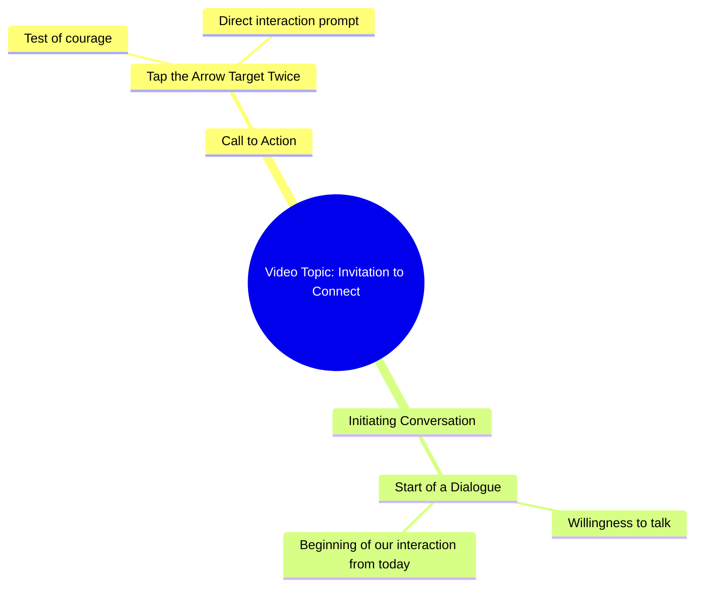

# Would You Touch This Arrow Mark Twice

> 🌐 **Read this in:** [English](../../en/2026-10/tiktok-transcript-10m-views-171k-reactions-03045658506-5568.md) · **中文**

> **Creator:** [@03045658506](https://www.tiktok.com/@03045658506) · **Views:** 4.3M · **Posted:** 2026-10-05 · **Niche:** other
>
> **TL;DR:** Poses a daring question that challenges the viewer's courage, compelling them to engage.

[Watch original video →](https://www.facebook.com/share/r/1Hq5QPQK7c/)

## Why This Went Viral

## 钩子（前3秒）
- 逐字稿：“क्या आप हिम्मत करेंगे? इस तीर वाले निसान पर दो बार टच करके देखो。”（你敢吗？试着在这个带箭头的目标上触摸两次。）
- 模式：**包裹在问题中的直接挑战／激将**——一种“勇气测试”式钩子。
- 为什么它能阻止滑动：它发出一个针对个人的、第二人称的挑战（“आप... हिम्मत करेंगे？”），要求观众立刻自我检查（“我敢吗？”）。身体动作指令（“触摸两次”）制造了一个微型承诺循环——观众的拇指已经在屏幕上，所以这个动作感觉只差一次点击。好奇＋自尊＋互动性，全在一句话里。

## 情绪节奏
- **0–2秒——挑战／好奇：**“क्या आप हिम्मत करेंगे？”触发自尊＋兴趣。
- **2–5秒——指令／张力：**“दो बार टच करके देखो”把被动观看转化为一个待执行动作；悬念围绕“如果你触摸了会发生什么”不断累积。
- **5–10秒——承诺／缓解：**“अगर आप सच में मुझसे बात करना चाहते हैं...”把挑战重新框定为邀请——张力化解为亲密感和奖励。
- **高潮：**转折句“शायद आज से हमारी बातचीत की सुरुवात हो जाए”——原来“挑战”其实是通往一段关系的门。这是意义从游戏翻转为连接的地方。
- 共鸣落在最后一个词“सुरुवात”（开始）上——它留下了一个开放循环，观众会想通过互动来闭合它。

## 关键词密度
- **हिम्मत**（勇气／敢）——情绪拉力；触发自尊。
- **टच / टच करके**（触摸）——算法触达；平台原生动作词，与互动绑定。
- **निसान / तीर**（目标／箭）——视觉／好奇关键词；具体且能阻止滑动。
- **दो बार**（两次）——具体性；让指令显得真实、可测试。
- **सच में**（真的／真正地）——情绪拉力；传递真实性。
- **बात करना / बातचीत**（说话／对话）——情绪拉力；承诺连接。
- **आज से**（从今天起）——紧迫感＋新鲜感。
- **सुरुवात**（开始）——情绪回报词；暗示新篇章。

算法驱动因素：*टच、दो बार、आज*（动作＋具体性＋时效性）。情绪驱动因素：*हिम्मत、सच में、बातचीत、सुरुवात*（挑战＋真诚＋关系）。

## 为什么它会传播
- **第二人称挑战迫使自我投射。**“क्या आप हिम्मत करेंगे？”让每个观众都成为主角——人们会分享那些感觉像是专门针对自己的内容。
- **藏在谜题里的身体行动号召。**“दो बार टच करके देखो”把被动观看变成一次点击，而点击会喂养算法——互动带来触达。
- **诱饵式反转回报。**挑战看起来像游戏，却最终落到“शायद आज से हमारी बातचीत की सुरुवात हो जाए”——一个柔和、情绪化的转折，让观众重看并评论（“我摸了，然后呢？”）。
- **开放循环＝评论燃料。**视频从不解释触摸*会*怎样——这种模糊性正是评论区的工作，而评论是最强的分发信号。
- **低制作、高亲密感的语气。**“अगर आप सच में मुझसे बात करना चाहते हैं”这句话把创作者定位为可接近的人，这会推动关注和私信——这两个指标会把一条Reel推入更广的流量池。

## 你可以借鉴什么
- **用挑战开场，而不是描述。**把“这里有一个关于X的技巧”换成“你敢试试X吗？”——自尊驱动的钩子比信息型钩子表现更好。
- **把身体动作埋进钩子里。**在前3秒给观众一些*可做*的事（点击、评论一个词、截图）。动作会训练算法持续推送你的视频。
- **以未解决的情绪承诺收尾。**不要闭合循环——留下类似“也许今天就是开始的地方”这样的句子，让观众评论、重看或私信来弄清接下来会发生什么。

## Mind Map

## Full Transcript (Generated by [TokTranscript 转录工具](https://toktranscript.com/?utm_source=github&utm_medium=breakdown&utm_campaign=tool_attribution))

> 📝 Transcripts on this page are auto-generated and show the first 60%. Want to transcribe any TikTok in 30 seconds and get the full version? [Try TokTranscript free →](https://toktranscript.com/?utm_source=github&utm_medium=breakdown&utm_campaign=transcript_cta)

क्या आप हिम्मत करेंगे? इस तीर वाले निसान पर दो बार टच करके देखो. अगर आप सच में मुझसे बात क

*[Read the full transcript on TokTranscript →](https://toktranscript.com/plaza/tiktok-transcript-10m-views-171k-reactions-03045658506-5568?utm_source=github&utm_medium=breakdown&utm_campaign=transcript_full)*

## Browse More

- All [other](../../by-niche/zh-CN/other.md) breakdowns
- All [Challenge Question](../../by-pattern/zh-CN/hook-challenge-question.md) examples

## Video Info

| | |
|---|---|
| Creator | [@03045658506](https://www.tiktok.com/@03045658506) |
| Original video | [https://www.facebook.com/share/r/1Hq5QPQK7c/](https://www.facebook.com/share/r/1Hq5QPQK7c/) |
| Original title | 10M views · 171K reactions | کیا آپ ہمت کریں گے | 03045658506 |
| Views | 4.3M (4328992) |
| Posted | 2026-10-05 |
| Duration | 0s |
| Niche | `other` |
| Hook pattern | `Challenge Question` |
| Original language | `en` (this page translated by AI) |
| Available languages | en, zh-CN |
| Generated | 2026-10-06 by [TokTranscript](https://toktranscript.com/) |

---

*This breakdown is for educational analysis under fair use. Original video © [@03045658506](https://www.tiktok.com/@03045658506). All transcripts are auto-generated and may contain errors.*

*Want to analyze your own TikToks like this? [我们用的转录工具 →](https://toktranscript.com/viral-breakdown?utm_source=github&utm_medium=breakdown&utm_campaign=footer_cta)*