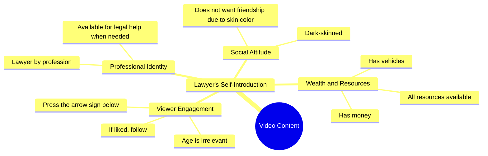

# Lawyer Seeks Friendship Despite Color Bias

> 🌐 **Read this in:** [English](../../en/2026-10/tiktok-transcript-10m-views-251k-reactions-wafa-world-facebookreels-reels-tren-1e59.md) · **中文**

> **Creator:** [@Sifa Ansari](https://www.tiktok.com/@Sifa Ansari) · **Views:** 3.7M · **Posted:** 2026-10-08 · **Niche:** other
>
> **TL;DR:** The hook presents a personal problem (skin color affecting friendship) and implies a solution (offering help as a lawyer) while evoking empathy.

[Watch original video →](https://www.facebook.com/reel/1064161166385847/?app=fbl)

## Why This Went Viral

## 钩子（前3秒）
- 逐字开场白：“我是律师，有什么事需要帮忙就告诉我，钱、车什么都有”（“I'm a lawyer, tell me if you ever need anything — I have money, a car, everything”）
- 钩子模式：**身份炫耀 + 开放邀请**（权威 + 资源声明），紧接着下一句用自嘲式反差立刻削弱
- 为什么能让人停下滚动：它一开始就抛出高身份标签（律师、钱、车），触发好奇心和社交比较，然后紧接着下一拍（“我皮肤黑，所以没人愿意和我做朋友”——“I'm dark-skinned, so nobody wants to be friends”）制造出刺耳的情绪急转。这种权力与脆弱之间的反差，就是让人手指停住的原因。

## 情绪节奏
- **第1拍 – 好奇/身份吸引：**“我是律师……钱、车什么都有”→ 观众预期是炫耀或凡尔赛式自夸
- **第2拍 – 紧张/情绪重击：**“我皮肤黑，所以没人愿意和我做朋友”→ 突然转向被拒绝和孤独；悬念落在这里，因为观众现在想知道*为什么*会有这种矛盾
- **第3拍 – 共鸣：**“不管多大年纪，只要喜欢我……”→ 普遍吸引力，不分年龄，邀请观众代入
- **第4拍 – 反转/高潮：**“关注并点击下面的箭头”→ 情绪铺垫被转化为直接CTA；高潮就是从痛苦转向行动
- **高潮时刻：**从“没人愿意和我做朋友”过渡到“如果你喜欢我，就关注并点击下面的箭头”——脆弱本身成为转化触发器

## 关键词密度
- **वकील**（律师）– 权威关键词；提升可信度，并激发算法对“专业”内容的兴趣
- **पैसा, गाड़ी**（钱、车）– 身份/向往关键词；情绪拉力强，传递“成功故事”信号
- **काली**（皮肤黑）– 情绪核心；驱动共鸣和评论区争论，从而推动算法传播
- **दोस्ती**（友谊）– 普遍情绪关键词；让可共鸣性超越任何垂直领域
- **उमर**（年龄）– 包容性关键词；传递“无论你多大都适用”
- **पसंद**（喜欢）– 互动关键词；直接引导点赞/关注行为
- **फॉलो**（关注）– 明确CTA关键词；算法传播驱动因素
- **तीर के निशान**（箭头标记）– 平台特定CTA；推动点击和完播率

哪些驱动传播 vs. 拉动情绪：**वकील、फॉलो、तीर के निशान**驱动算法传播（它们传递专业内容信号 + 明确互动指令）。**काली、दोस्ती、पैसा、गाड़ी**驱动情绪拉力（它们触发身份认同、向往和不安全感）。

## 为什么会传播
- **反差钩子 = 模式打断。**“钱、车什么都有”紧接着“我皮肤黑，所以没人愿意和我做朋友”制造认知失调——观众会重看或暂停来消化这种矛盾，从而提升观看时长。
- **基于身份的可共鸣性。**“我皮肤黑”触及印度短视频内容中广泛共享但很少被说出的不安全感；有共鸣的观众会评论、分享或@朋友，这向算法发出继续推送的信号。
- **身份 + 脆弱组合。**“我是律师”提供权威，“没人愿意和我做朋友”提供脆弱——这种双重信号让创作者既令人向往又平易近人，提高关注意愿。
- **不分年龄的包容。**“不管多大年纪”明确移除人口统计过滤，把潜在受众扩大到平台上几乎所有人。
- **直接、低摩擦CTA。**“关注并点击下面的箭头”是清晰的两步行动指令，放在情绪峰值之后——在情绪准备度最高时获得最大顺从。

## 你可以借鉴什么
1. **先用身份炫耀开场，然后立刻削弱它。**先抛出你最强的资历或资产，然后在同一口气里转向个人脆弱。这种急转就是钩子。
2. **让你的痛苦具有普遍性，而不是小众化。**用广泛身份标记（“不管多大年纪”）替代具体细节，让任何观看的人都感觉是在对自己说话。
3. **把CTA放在情绪高潮处，而不是结尾。**不要等到自然停顿——把情绪共鸣最高的时刻直接转化为“关注/点击箭头”。

## Mind Map

## Full Transcript (Generated by [TokTranscript](https://toktranscript.com/?utm_source=github&utm_medium=breakdown&utm_campaign=tool_attribution))

> 📝 Transcripts on this page are auto-generated and show the first 60%. Want to transcribe any TikTok in 30 seconds and get the full version? [Try TokTranscript free →](https://toktranscript.com/?utm_source=github&utm_medium=breakdown&utm_campaign=transcript_cta)

वकील हूँ, किसी काम में जरूरत पड़े तो बता देना, पैसा, गाड़ी सब है, काली हूँ इसले कोई दोस्ती नहीं करना च

*[Read the full transcript on TokTranscript →](https://toktranscript.com/plaza/tiktok-transcript-10m-views-251k-reactions-wafa-world-facebookreels-reels-tren-1e59?utm_source=github&utm_medium=breakdown&utm_campaign=transcript_full)*

## Browse More

- All [other](../../by-niche/zh-CN/other.md) breakdowns
- All [Problem-Solution with Vulnerability](../../by-pattern/zh-CN/hook-problem-solution-with-vulnerability.md) examples

## Video Info

| | |
|---|---|
| Creator | [@Sifa Ansari](https://www.tiktok.com/@Sifa Ansari) |
| Original video | [https://www.facebook.com/reel/1064161166385847/?app=fbl](https://www.facebook.com/reel/1064161166385847/?app=fbl) |
| Original title | 10M views · 251K reactions | Wafa World 😘🥀 #FacebookReels #Reels #TrendingReels #ReelsVideo #ShortVideo #ViralVideo #Explore #ForYou #Dosti #Friendship #OnlineDosti #DesiVibes #UrduPosts #followformoreL | Sifa Ansari |
| Views | 3.7M (3745926) |
| Posted | 2026-10-08 |
| Duration | 0s |
| Niche | `other` |
| Hook pattern | `Problem-Solution with Vulnerability` |
| Original language | `en` (this page translated by AI) |
| Available languages | en, zh-CN |
| Generated | 2026-10-08 by [TokTranscript](https://toktranscript.com/) |

---

*This breakdown is for educational analysis under fair use. Original video © [@Sifa Ansari](https://www.tiktok.com/@Sifa Ansari). All transcripts are auto-generated and may contain errors.*

*Want to analyze your own TikToks like this? [TokTranscript 转录工具 →](https://toktranscript.com/viral-breakdown?utm_source=github&utm_medium=breakdown&utm_campaign=footer_cta)*