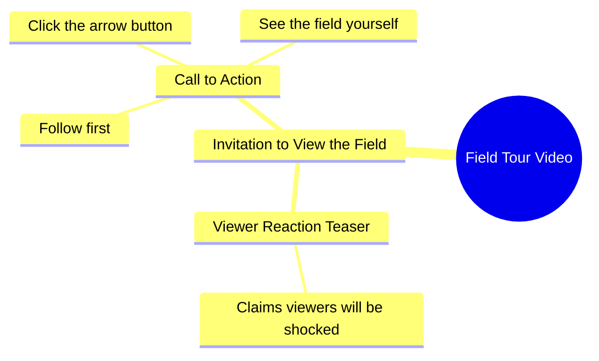

# Woman Shows Her Lush Green Farm Field

> 🌐 **Read this in:** [English](../../en/2026-10/tiktok-transcript-16m-views-213k-reactions-wafa-world-facebookreelsviral-reels-9831.md) · **中文**

> **Creator:** [@Sujata ](https://www.tiktok.com/@Sujata ) · **Views:** 5.7M · **Posted:** 2026-10-09 · **Niche:** other
>
> **TL;DR:** The hook uses a shocking claim about the field and a direct challenge to the viewer to follow and watch, creating curiosity and engagement.

[Watch original video →](https://www.facebook.com/share/r/1BgEoFAZoj/)

## Why This Went Viral

## 钩子（前3秒）
- 逐字开场白：“जो खेत में आपको दिखाने वाली हूँ, आप मेरा खेत देखकर शायद आपके होश उड़ जाएंगे.”（我要给你看的地里——看到我的地，你可能会惊掉下巴。）
- 钩子模式：**大胆断言 + 延迟揭示。** 承诺有震撼内容，却故意先不展示。
- 为什么能让人停下滑动：它在一句话里同时制造了信息缺口（“地里有什么？”）和情绪筹码（“你会惊掉下巴”）。大脑无法放着承诺的回报不解决，所以拇指就停住了。

## 情绪节奏
- **第1拍——好奇飙升：** “आपके होश उड़ जाएंगे”在任何画面出现前就设定了震惊预期。
- **第2拍——挑战/自尊诱饵：** “हिम्मत है तो पहले फॉलो करो”把观众拉进一场叫板。自尊被激活。
- **第3拍——微承诺：** “फिर तीर के बटन पे क्लिक करके”把叫板变成必须执行的动作（关注 → 点箭头）。
- **第4拍——延迟回报：** “खुद खेत देख लो”把揭示交给观众，把悬念一直维持到切镜。
- **高潮：** “आपके होश उड़ जाएंगे”这句是情绪峰值——之后的一切都是通往揭示的漏斗。
- 悬念落在*被扣住的画面*上，而不是任何事件上。张力是制造出来的，不是展示出来的。

## 关键词密度
- **खेत**（地）——锚点关键词；驱动农业内容的话题/算法定向。
- **आपको / आप**（你）——直接称呼代词；强制建立个人相关性，提升留存。
- **होश उड़ जाएंगे**（惊掉下巴）——情绪拉动短语；点击诱饵引擎。
- **हिम्मत**（胆量）——自尊触发器；把被动观众转化为评论者。
- **फॉलो**（关注）——明确的算法CTA。
- **तीर का बटन**（箭头按钮）——平台原生指令；提升完播和点击。
- **देख लो / दिखाने**（看/展示）——重复的揭示动词；强化承诺。
- **驱动触达：** खेत、फॉलो、तीर का बटन（话题 + 互动信号）。
- **驱动情绪：** होश उड़ जाएंगे、हिम्मत、आप（震惊 + 自尊 + 直接称呼）。

## 为什么它会传播
- **人为制造的好奇缺口：** “जो खेत में आपको दिखाने वाली हूँ”承诺了一个片段中从未展示的揭示——观众必须关注/继续看才能闭环。
- **基于自尊的叫板机制：** “हिम्मत है तो पहले फॉलो करो”把自尊武器化。人们为了证明自己不怕而关注，为了拆穿虚张声势而评论。
- **明确的两步CTA：** “पहले फॉलो करो, फिर तीर के बटन पे क्लिक करके”把关注 + 点击打包成一条指令，在一个节拍里同时拉高粉丝数和互动信号。
- **夸张的情绪承诺：** “आपके होश उड़ जाएंगे”是可分享的语言——观众会转发给朋友说“看这个，太疯了”。
- **直接称呼的亲密感：** 反复出现的“आप”让每个观众都感觉被单独挑战，这提高了评论和回复率——短视频平台上最强的分发杠杆。

## 你可以偷走什么
1. **用被扣住的承诺开场，而不是回报本身。** 说明那个震撼的东西存在（“你不会相信我地里有什么”），然后延迟展示——在前3秒，好奇胜过交付。
2. **用自尊叫板作为你的CTA。** 把“请关注”换成“有胆你就先关注”——自尊的转化效果远好于礼貌。
3. **把CTA叠进一句话。** “先关注，再点箭头”一口气串起两个动作，让观众不用做两次决定就能都执行。

## Mind Map

## Full Transcript (Generated by [TokTranscript 转录工具](https://toktranscript.com/?utm_source=github&utm_medium=breakdown&utm_campaign=tool_attribution))

> 📝 Transcripts on this page are auto-generated and show the first 60%. Want to transcribe any TikTok in 30 seconds and get the full version? [Try TokTranscript free →](https://toktranscript.com/?utm_source=github&utm_medium=breakdown&utm_campaign=transcript_cta)

जो खेत में आपको दिखाने वाली हूँ, आप मेरा खेत देखकर शायद आपके होश उड़ जाएंगे. हिम्मत है तो

*[Read the full transcript on TokTranscript →](https://toktranscript.com/plaza/tiktok-transcript-16m-views-213k-reactions-wafa-world-facebookreelsviral-reels-9831?utm_source=github&utm_medium=breakdown&utm_campaign=transcript_full)*

## Browse More

- All [other](../../by-niche/zh-CN/other.md) breakdowns
- All [Shock + Challenge](../../by-pattern/zh-CN/hook-shock-challenge.md) examples

## Video Info

| | |
|---|---|
| Creator | [@Sujata ](https://www.tiktok.com/@Sujata ) |
| Original video | [https://www.facebook.com/share/r/1BgEoFAZoj/](https://www.facebook.com/share/r/1BgEoFAZoj/) |
| Original title | 16M views · 213K reactions | Wafa World 🥀 #facebookreelsviral #reelsfb #trendingreelsvideo #reelsvideo #shortvideofbreels #viralvideo #explore #dosti #friendshipgoals #OnlineDosti #DesiVibe #urdupostdaily #followformore | Sujata |
| Views | 5.7M (5715992) |
| Posted | 2026-10-09 |
| Duration | 0s |
| Niche | `other` |
| Hook pattern | `Shock + Challenge` |
| Original language | `en` (this page translated by AI) |
| Available languages | en, zh-CN |
| Generated | 2026-10-10 by [TokTranscript](https://toktranscript.com/) |

---

*This breakdown is for educational analysis under fair use. Original video © [@Sujata ](https://www.tiktok.com/@Sujata ). All transcripts are auto-generated and may contain errors.*

*Want to analyze your own TikToks like this? [免费 TikTok 文稿生成器 →](https://toktranscript.com/viral-breakdown?utm_source=github&utm_medium=breakdown&utm_campaign=footer_cta)*