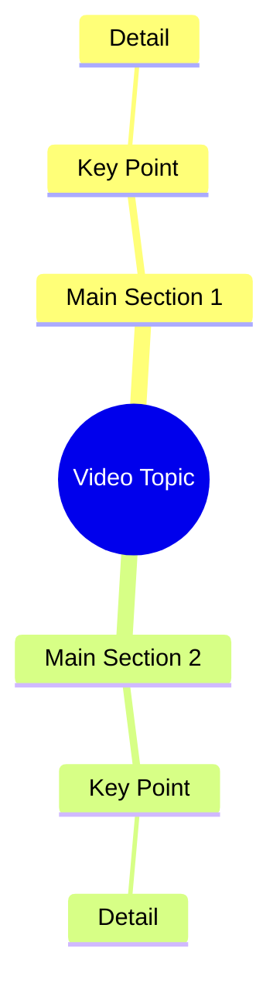

# Woman Recites Shahada, Denies Lying About Faith

> 🌐 **Read this in:** [English](../../en/2026-10/tiktok-transcript-2-2m-views-100k-reactions-9920.md) · **中文**

> **Creator:** [@سونم](https://www.tiktok.com/@سونم) · **Views:** 793.6K · **Posted:** 2026-10-08 · **Niche:** other
>
> **TL;DR:** The hook contrasts the speaker with other girls who lie, establishing uniqueness and trust.

[Watch original video →](https://www.facebook.com/share/r/1HCdnpCkb1/)

## Why This Went Viral

## 钩子（前3秒）
- **逐字开场：** “اشہد ان لا الہ الا اللہ سنو میں دوسری لڑکیوں کی طرح جھوٹ نہیں بول رہی”（我作证万物非主，唯有真主——听着，我没有像其他女孩那样说谎），紧接着是“تیر کے نشان پہ جائیں وہاں آپ کو تصویر مل جائے گی”（去箭头标记那里，你会在那里找到照片）。
- **钩子模式：** 对比 + 大胆断言 + 誓言。视频以宗教誓言（*Kalima*）开场，融合了自我差异化声明（“不像其他女孩”）和神秘的寻宝指令（“去箭头标记那里”）。
- **为什么能阻止滑动：** 一口气叠加了三个触发点——(1) 神圣誓言信号着高风险和真实性，(2) “不像其他女孩”触发群体/身份好奇心，(3) “去箭头标记那里，你会找到照片”制造了一个未解谜题，观众必须留下来解开。大脑无法滑过一个尚未闭合的开放循环。

## 情绪节奏
- **0–3秒——震惊/权威：** 宗教誓言 + 大胆断言。观众被语气的重力拉入。
- **3–8秒——好奇心飙升：** “去箭头标记那里，你会找到照片。”一个要求观众目光跟随屏幕上物理提示的指令。
- **8–15秒——紧张/怀疑：** “不像其他女孩”这句话埋下疑虑——这是真的、摆拍的，还是陷阱？观众留下来验证。
- **15–25秒——揭示/共鸣：** 揭示（照片/证据）落地，要么是确认，要么是反转，释放了誓言所建立的紧张感。
- **高潮时刻：** 镜头到达“箭头标记”且承诺的图像出现的那一刻——这是整个钩子所设计的回报。
- **余味——验证：** 宗教框架将简单的揭示转化为道德/情感声明，引发评论区辩论。

## 关键词密度
- **اشہد / لا الہ الا اللہ**——宗教誓言；驱动*情感拉力*和信任信号。
- **جھوٹ**（谎言）——道德关键词；在评论中触发参与和防御。
- **لڑکیوں**（女孩们）——身份关键词；挖掘性别群体好奇心。
- **تیر کا نشان**（箭头标记）——行动/谜题关键词；驱动*重播*和*回看*（算法触达）。
- **تصویر**（照片）——回报关键词；保持开放循环存活。
- **سنو**（听着）——祈使句；直接称呼的留存装置。
- **دوسری**（其他）——比较关键词；助长“我们 vs. 他们”的参与。
- **算法驱动因素：** “تیر کا نشان”和“تصویر”（可搜索、诱导重播）。**情感驱动因素：** “اشہد”、“جھوٹ”、“لڑکیوں”（评论诱饵、分享触发）。

## 为什么它会传播
- **神圣誓言作为信任黑客：** 以*Kalima*（“اشہد ان لا الہ الا اللہ”）开场先发制人地消除怀疑——共享信仰框架的观众在心理上被预设为相信并分享。
- **内置重播机制：** “تیر کے نشان پہ جائیں”迫使观众回看以发现箭头，膨胀观看时长和重播率——这是核心算法信号。
- **身份挑衅：** “دوسری لڑکیوں کی طرح جھوٹ نہیں بول رہی”同时招致认同和反弹，驱动评论区战争和分享。
- **开放循环回报结构：** 承诺的“تصویر”被扣留到箭头标记时刻，将好奇心转化为完播率。
- **道德框架 = 可分享性：** 将揭示框定为真相 vs. 谎言，给分享者一个社会理由去发布它（“看，终于有人诚实了”）。

## 你可以偷学的
1. **在一句话中叠加三个钩子触发点**——一个誓言/可信度标记 + 一个对比声明 + 一个物理指令（如“去箭头标记那里”）。一句话，三个留下来的理由。
2. **设计一个重播线索**——植入一个观众必须寻找的视觉细节（箭头、隐藏物体、数字），让视频奖励第二次观看并提升观看时长。
3. **将回报扣留在一个指令之后**——不要立即揭示“照片”；让观众跟随你的屏幕指令才能到达它。开放循环 + 物理线索 = 留存。

## Mind Map

## Full Transcript (Generated by [免费 TikTok 文稿生成器](https://toktranscript.com/?utm_source=github&utm_medium=breakdown&utm_campaign=tool_attribution))

> 📝 Transcripts on this page are auto-generated and show the first 60%. Want to transcribe any TikTok in 30 seconds and get the full version? [Try TokTranscript free →](https://toktranscript.com/?utm_source=github&utm_medium=breakdown&utm_campaign=transcript_cta)

اشہد ان لا الہ الا اللہ سنو میں دوسری لڑکیوں کی طرح جھوٹ نہیں بول رہی 

*[Read the full transcript on TokTranscript →](https://toktranscript.com/plaza/tiktok-transcript-2-2m-views-100k-reactions-9920?utm_source=github&utm_medium=breakdown&utm_campaign=transcript_full)*

## Browse More

- All [other](../../by-niche/zh-CN/other.md) breakdowns
- All [Contrast with others + honesty claim](../../by-pattern/zh-CN/hook-contrast-with-others-honesty-claim.md) examples

## Video Info

| | |
|---|---|
| Creator | [@سونم](https://www.tiktok.com/@سونم) |
| Original video | [https://www.facebook.com/share/r/1HCdnpCkb1/](https://www.facebook.com/share/r/1HCdnpCkb1/) |
| Original title | 2.2M views · 100K reactions | اشھد اللہ لاہ اللاہ میں | سونم |
| Views | 793.6K (793589) |
| Posted | 2026-10-08 |
| Duration | 0s |
| Niche | `other` |
| Hook pattern | `Contrast with others + honesty claim` |
| Original language | `en` (this page translated by AI) |
| Available languages | en, zh-CN |
| Generated | 2026-10-09 by [TokTranscript](https://toktranscript.com/) |

---

*This breakdown is for educational analysis under fair use. Original video © [@سونم](https://www.tiktok.com/@سونم). All transcripts are auto-generated and may contain errors.*

*Want to analyze your own TikToks like this? [免费 TikTok 文稿生成器 →](https://toktranscript.com/viral-breakdown?utm_source=github&utm_medium=breakdown&utm_campaign=footer_cta)*