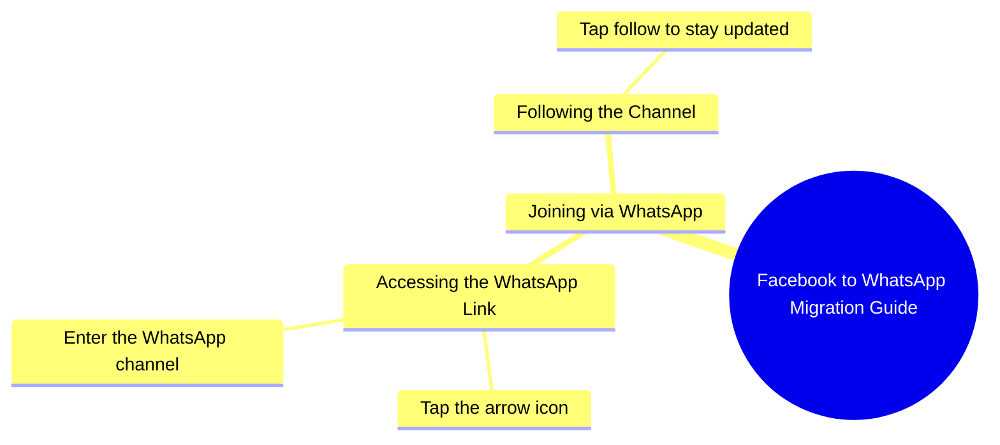

# Samina Rani Invites Followers to WhatsApp

> 🌐 **Read this in:** [English](../../en/2026-10/tiktok-transcript-2-2m-views-56k-reactions-hi-samina-rani-07e9.md) · **中文**

> **Creator:** [@Samina Rani](https://www.tiktok.com/@Samina Rani) · **Views:** 799.0K · **Posted:** 2026-10-03 · **Niche:** other
>
> **TL;DR:** The hook directly acknowledges viewers from Facebook and invites them to WhatsApp, creating a sense of personal connection and curiosity.

[Watch original video →](https://www.facebook.com/share/r/1EBJv93D55/)

## Why This Went Viral

## 钩子（前3秒）
- **逐字开场：** “اچھا تو فیس بک پہ تو ملی گئے ہو آجاؤ میری ووٹس ایپ پر”（“所以你在Facebook上找到我了——现在来我的WhatsApp”）
- **钩子模式：** 直接点名 + 平台迁移指令（一种“你在这里，现在去那里”的模式）。
- **为什么能让人停下滚动：** 它把观众当作在滚动中途被当场抓住的人来称呼（“تو ملی گئے ہو”——“所以你*确实*找到我了”）。这在瞬间制造出第二人称的认同感，而WhatsApp上有更多东西的承诺则在3秒内触发好奇心和FOMO。

## 情绪节奏
- **节拍1 – 认同/好奇：** “所以你在Facebook上找到我了” → 观众感到被看见，身体前倾。
- **节拍2 – 命令/紧迫：** “آجاؤ میری ووٹس ایپ پر” → 势头增强，明确要求行动。
- **节拍3 – 承诺/张力：** “میں آپ کو بتاتی ہوں ووٹس ایپ پر کیسے آنا ہے” → 她承诺要*教*某件事，制造出微型悬念。
- **节拍4 – 指示/释放：** “اس تیر کے نشان کے اوپر دبا کر” → “箭头”指示用具体步骤化解了张力。
- **节拍5 – 收尾/承诺：** “فالو کر لیں” → 最终CTA，把好奇心转化为行动。
- **高潮：** “میں آپ کو بتاتی ہوں... کیسے آنا ہے”这句——这是承诺达到顶点、观众拇指悬停并决定关注的地方。

## 关键词密度
- **فیس بک**（Facebook）——平台锚点，推动跨平台触达。
- **ووٹس ایپ**（WhatsApp）——重复3次；核心目的地关键词，在算法上很有力，因为它释放出向站外迁移的信号。
- **آجاؤ / آنا**（来 / 到来）——行动动词，驱动CTA能量。
- **تیر کا نشان**（箭头标志）——UI指示关键词；提升观看时长，因为观众会反复观看以找到它。
- **فالو کر لیں**（关注）——直接互动关键词，为算法的关注信号提供输入。
- **میں آپ کو بتاتی ہوں**（我会告诉你）——承诺短语，情绪拉力。
- **算法驱动因素：** “WhatsApp”“follow”“Facebook”——这些会触发分发，因为平台会奖励跨应用迁移线索和明确CTA。
- **情绪拉力：** “میں آپ کو بتاتی ہوں”和“آجاؤ”——这些制造亲密感和紧迫感，让观众持续观看。

## 为什么它会传播
- **个人化点名制造准社会亲密感：** “فیس بک پہ تو ملی گئے ہو”让每个观众都感觉被单独点名，因此他们会像分享“专门给自己”的内容一样分享它。
- **跨平台迁移是病毒式循环：** 通过把Facebook观众推向WhatsApp，她将一个平台的受众转化为另一个平台的受众——而WhatsApp转发是南亚最强的分发渠道。
- **教学式微型教程 = 高完播率：** “اس تیر کے نشان کے اوپر دبا کر”迫使观众看到最后才能找到箭头，从而提升观看时长（顶级排名信号）。
- **低阻力CTA叠加：** “آ جائیں اور فالو کر لیں”——一口气两个行动，因此即使是被动观众也会转化。
- **语言 + 语气匹配受众：** 纯乌尔都语、随意的女性声音、没有术语——完美契合目标人群，因此感觉原生且易于分享。

## 你可以借鉴什么
1. **用“你找到我了”的点名开场。** 在视频开头承认观众从哪里来（“所以你是从TikTok来的……”）——这会让他们感觉被个人化地看见，并停止滚动。
2. **在视频中承诺一个微型教程。** 说“我会教你如何……”然后在屏幕上给出步骤。承诺负责钩住；指示负责留住。
3. **在一句话里叠加两个CTA。** 不要只说“关注我”——说“来这里并关注”，这样你就能在一个节拍里同时捕获迁移和互动。

## Mind Map

## Full Transcript (Generated by [免费 TikTok 文稿生成器](https://toktranscript.com/?utm_source=github&utm_medium=breakdown&utm_campaign=tool_attribution))

> 📝 Transcripts on this page are auto-generated and show the first 60%. Want to transcribe any TikTok in 30 seconds and get the full version? [Try TokTranscript free →](https://toktranscript.com/?utm_source=github&utm_medium=breakdown&utm_campaign=transcript_cta)

اچھا تو فیس بک پہ تو ملی گئے ہو آجاؤ میری ووٹس ایپ پر میں آپ کو بتاتی ہوں ووٹس ایپ پر کیسے آنا ہے اس

*[Read the full transcript on TokTranscript →](https://toktranscript.com/plaza/tiktok-transcript-2-2m-views-56k-reactions-hi-samina-rani-07e9?utm_source=github&utm_medium=breakdown&utm_campaign=transcript_full)*

## Browse More

- All [other](../../by-niche/zh-CN/other.md) breakdowns
- All [Direct Address & Platform Transition](../../by-pattern/zh-CN/hook-direct-address-platform-transition.md) examples

## Video Info

| | |
|---|---|
| Creator | [@Samina Rani](https://www.tiktok.com/@Samina Rani) |
| Original video | [https://www.facebook.com/share/r/1EBJv93D55/](https://www.facebook.com/share/r/1EBJv93D55/) |
| Original title | 2.2M views · 56K reactions | Hi | Samina Rani |
| Views | 799.0K (798960) |
| Posted | 2026-10-03 |
| Duration | 0s |
| Niche | `other` |
| Hook pattern | `Direct Address & Platform Transition` |
| Original language | `en` (this page translated by AI) |
| Available languages | en, zh-CN |
| Generated | 2026-10-04 by [TokTranscript](https://toktranscript.com/) |

---

*This breakdown is for educational analysis under fair use. Original video © [@Samina Rani](https://www.tiktok.com/@Samina Rani). All transcripts are auto-generated and may contain errors.*

*Want to analyze your own TikToks like this? [TokTranscript →](https://toktranscript.com/viral-breakdown?utm_source=github&utm_medium=breakdown&utm_campaign=footer_cta)*