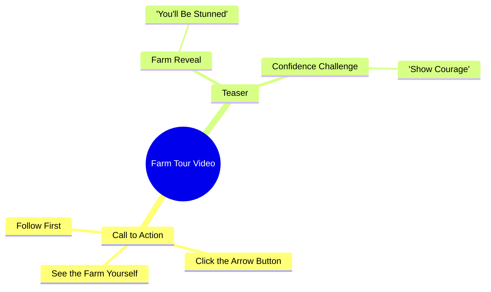

# Farmer Shows Off Her Field in Viral Video

> 🌐 **Read this in:** [English](../../en/2026-10/tiktok-transcript-2-7m-views-47k-reactions-03456585060-5155.md) · **中文**

> **Creator:** [@03456585060](https://www.tiktok.com/@03456585060) · **Views:** 1.1M · **Posted:** 2026-10-07 · **Niche:** other
>
> **TL;DR:** The hook uses exaggerated shock language and a direct challenge to compel viewers to follow and watch.

[Watch original video →](https://www.facebook.com/share/r/1CPN7KhcFE/)

## Why This Went Viral

## 钩子（前3秒）
- **逐字开场白：** “जो खेत में आपको दिखाने वाली हूं आप मेरा खेत देखकर शायद आपके होश उड़ जाएंगे”（“我要带你在田里看的东西——看到我的田，你可能会吓得魂飞魄散。”）
- **钩子模式：** 大胆断言 + 震惊承诺，紧接着绑定一个挑战（“हिम्मत है तो पहले फॉलो करो”——“有胆量的话，先关注”）。
- **为什么能让人停下滚动：** 它在前端加载了一个极端情绪承诺（“होश उड़ जाएंगे”＝你会被惊呆），却还没有任何视觉回报，制造了一个观众必须填补的信息缺口。挑衅（“हिम्मत है तो”）把观众翻转成挑战者角色，而关注门槛则在揭晓前把好奇心转化为行动。

## 情绪节奏
- **0–2秒——好奇心飙升：** “होश उड़ जाएंगे”埋下一个夸张的回报承诺。
- **2–5秒——挑战／自尊触发：** “हिम्मत है तो पहले फॉलो करो”挑衅观众；轻微紧张感（我够勇敢吗？）。
- **5–8秒——指令／承诺：** “तीर के बटन पे क्लिक करके”（点击箭头按钮）——把动作仪式化，建立期待。
- **8秒+——延迟揭晓：** “खुद खेत देख लो”（自己去看田吧）——回报被交还给观众，把悬念延伸到视觉中。
- **高潮：** 田地真正被展示的那一刻——整个脚本都是为了把这个揭晓打造成情绪峰值。
- **反转机制：** “奖励”（田地）被关注门槛锁住，所以反转是结构性的，而不是叙事性的。

## 关键词密度
- **खेत**（田）——重复3次，锚定主题和搜索／兴趣信号。
- **देखना / देखकर / देख लो**（看／看到／去看）——3次，驱动“揭晓”好奇心循环。
- **होश उड़ जाएंगे**（你会被惊呆）——情绪载荷短语。
- **हिम्मत**（胆量）——自尊诱饵关键词。
- **फॉलो**（关注）——明确CTA，算法互动驱动因素。
- **तीर के बटन**（箭头按钮）——平台原生动作提示。
- **आप / आपके**（你／你的）——直接称呼，个性化并提升留存。
- **算法触达词：** फॉलो、तीर के बटन、खेत（主题信号）。
- **情绪牵引词：** होश उड़ जाएंगे、हिम्मत——这些制造停下观看的冲动；CTA词则将其转化。

## 为什么它会传播
- **带硬门槛的好奇心缺口：** “होश उड़ जाएंगे”承诺一个震惊揭晓却将其扣留——观众必须关注／观看才能解决缺口，从而推动完播率。
- **作为互动诱饵的自尊挑战：** “हिम्मत है तो”挑衅观众，把被动滚动转化为主动关注——挑战会触发基于身份的顺从。
- **明确的平台原生CTA：** “तीर के बटन पे क्लिक करके”告诉用户到底该点哪里，降低算法关键信号（关注、点击）的摩擦。
- **直接第二人称称呼：** 反复出现的“आप/आपके”让观众成为主角，提高个人相关性和观看时长。
- **延迟回报结构：** “खुद खेत देख लो”把揭晓交给观众，因此视频的价值只有留下来才能解锁——最大化留存。

## 你可以借鉴什么
- **用震惊承诺 + 挑衅组合开场：** 把夸张回报（“你会被惊呆”）与自尊挑战（“如果你敢……”）配对，在3秒内把好奇心转化为行动。
- **把回报锁在原生动作之后：** 说出确切的按钮／手势（“点击箭头”），让CTA无摩擦且对平台友好。
- **全程使用第二人称：** 反复的“你／你的”让观众成为英雄并提升留存——然后把揭晓交还给他们（“自己去看”），以延长观看时长。

## Mind Map

## Full Transcript (Generated by [我们用的转录工具](https://toktranscript.com/?utm_source=github&utm_medium=breakdown&utm_campaign=tool_attribution))

> 📝 Transcripts on this page are auto-generated and show the first 60%. Want to transcribe any TikTok in 30 seconds and get the full version? [Try TokTranscript free →](https://toktranscript.com/?utm_source=github&utm_medium=breakdown&utm_campaign=transcript_cta)

जो खेत में आपको दिखाने वाली हूं आप मेरा खेत देखकर शायद आपके होश उड़ जाएंगे हिम्मत है तो

*[Read the full transcript on TokTranscript →](https://toktranscript.com/plaza/tiktok-transcript-2-7m-views-47k-reactions-03456585060-5155?utm_source=github&utm_medium=breakdown&utm_campaign=transcript_full)*

## Browse More

- All [other](../../by-niche/zh-CN/other.md) breakdowns
- All [Shock + Challenge + Follow CTA](../../by-pattern/zh-CN/hook-shock-challenge-follow-cta.md) examples

## Video Info

| | |
|---|---|
| Creator | [@03456585060](https://www.tiktok.com/@03456585060) |
| Original video | [https://www.facebook.com/share/r/1CPN7KhcFE/](https://www.facebook.com/share/r/1CPN7KhcFE/) |
| Original title | 2.7M views · 47K reactions | جو کھیت میں آپ کو | 03456585060 |
| Views | 1.1M (1059170) |
| Posted | 2026-10-07 |
| Duration | 0s |
| Niche | `other` |
| Hook pattern | `Shock + Challenge + Follow CTA` |
| Original language | `en` (this page translated by AI) |
| Available languages | en, zh-CN |
| Generated | 2026-10-09 by [TokTranscript](https://toktranscript.com/) |

---

*This breakdown is for educational analysis under fair use. Original video © [@03456585060](https://www.tiktok.com/@03456585060). All transcripts are auto-generated and may contain errors.*

*Want to analyze your own TikToks like this? [TikTok 转录工具 →](https://toktranscript.com/viral-breakdown?utm_source=github&utm_medium=breakdown&utm_campaign=footer_cta)*