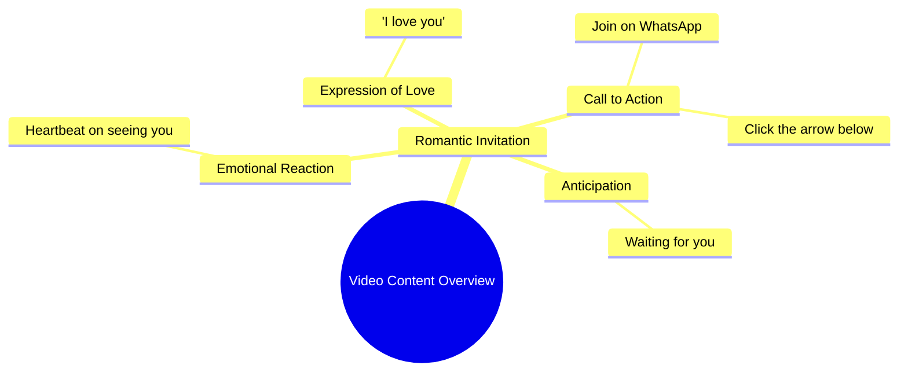

# Sheetal Devi Wins Para Archery Gold at Khelo India

> 🌐 **Read this in:** [English](../../en/2026-10/tiktok-transcript-3-5m-views-114k-reactions-jammu-and-kashmir-s-armless-archer-0e19.md) · **中文**

> **Creator:** [@Neha ](https://www.tiktok.com/@Neha ) · **Views:** 1.3M · **Posted:** 2026-10-08 · **Niche:** entertainment
>
> **TL;DR:** The hook uses a heartfelt confession to evoke emotion and curiosity, drawing viewers in.

[Watch original video →](https://www.facebook.com/reel/29186029990994560/?app=fbl)

## Why This Went Viral

## 钩子（前3秒）
- 逐字开场：“आपको देखकर दिल धड़क गया”（“看到你，我的心跳漏了一拍”）
- 钩子模式：**直接情感告白 / 大胆浪漫宣言**，直指观众
- 为什么能阻止滑动：它利用了第二人称称呼（“आपको”）——观众在不到2秒内就被个人化地“看见”并卷入其中。告白如此突然而亲密，会触发一种反射性的“等等，是我吗？”的停顿，然后大脑才反应过来。

## 情感节奏
- **0–2秒 — 赞美峰值：** 即时浪漫肯定（“दिल धड़क गया”）。
- **2–4秒 — 告白高峰：** “I love you”用英语落下，升级亲密感并加入语码转换的冲击。
- **4–7秒 — 指令/CTA转折：** “नीचे तीर पे क्लिक करके WhatsApp पे आ जाओ ना”从情感转向指令——当观众意识到有一个请求时，会产生轻微紧张感。
- **7–9秒 — 脆弱收尾：** “मैं आपका इंतिजार कर रही हूं”（“我在等你”）作为情感高潮落下——是渴望，不是要求。
- **高潮：** 最后一句。“Waiting for you”把一句普通的搭讪语转化为个人化、几乎绝望的恳求——这就是会被截图并分享的节拍。

## 关键词密度
- **आपको / आपका**（你 / 你的）——第二人称饱和；驱动准社会吸引力
- **दिल**（心）——情感触发词
- **I love you**——英语语码转换；提升跨语言信息流的触达
- **WhatsApp**——平台特定CTA关键词；触发站外意图
- **क्लिक**（点击）——动作动词；算法互动信号
- **इंतिजार**（等待）——渴望关键词；情感锚点
- **आ जाओ ना**（来吧，拜托）——柔和祈使；温柔标记

**算法触达驱动因素：** “WhatsApp”、“click”、“I love you”（英语）——这些匹配高流量搜索/信息流词元，并跨越语言推荐池。
**情感拉力驱动因素：** “दिल”、“इंतिजार”、“आ जाओ ना”——这些创造准社会纽带，把一次滑动转化为一条私信。

## 为什么它会传播
- **准社会定向：** “आपको देखकर”让每个观众都感觉被单独称呼——这句话只有在*你*就是那个“你”时才成立，这迫使个人认同。
- **语码转换诱饵：** 在印地语句子中插入英语“I love you”，传递出“现代、易接近、可分享”的信号——它把受众扩展到印地语母语者之外，并读起来像可模因化的短语。
- **内置站外漏斗：** “WhatsApp पे आ जाओ ना”给观众一个具体的下一步行动，所以视频不只是被观看——它会产生私信，而算法会将其解读为高意图互动。
- **脆弱循环：** “मैं आपका इंतिजार कर रही हूं”以未解决的情感音符结束——观众会重看或分享以化解紧张感，而重看是顶级排名信号。
- **低制作、高情绪反差：** 信息是最大化的浪漫，设置却最小化——容易二重唱、拼接、配字幕或回复，从而倍增衍生内容。

## 你可以偷学什么
1. **用第二人称情感开场，而不是背景。** 用一句让观众成为主体的话开始（“你让我的心……”）——不要介绍，不要铺垫。
2. **对一个关键短语做语码转换。** 在情感高峰插入一句高识别度的英语（或其他语言）台词，以扩大触达并让这一刻可引用。
3. **以未解决的恳求 + 具体CTA结束。** 把一句脆弱的收尾（“我在等你”）与一个具体行动（“来WhatsApp / 评论 / 私信”）配对，让情感转化为可衡量的互动。

## Mind Map

## Full Transcript (Generated by [免费 TikTok 文稿生成器](https://toktranscript.com/?utm_source=github&utm_medium=breakdown&utm_campaign=tool_attribution))

> 📝 Transcripts on this page are auto-generated and show the first 60%. Want to transcribe any TikTok in 30 seconds and get the full version? [Try TokTranscript free →](https://toktranscript.com/?utm_source=github&utm_medium=breakdown&utm_campaign=transcript_cta)

आपको देखकर दिल धड़क गया I love you नीचे तीर पे क्लिक करके Whats

*[Read the full transcript on TokTranscript →](https://toktranscript.com/plaza/tiktok-transcript-3-5m-views-114k-reactions-jammu-and-kashmir-s-armless-archer-0e19?utm_source=github&utm_medium=breakdown&utm_campaign=transcript_full)*

## Browse More

- All [entertainment](../../by-niche/zh-CN/entertainment.md) breakdowns
- All [Emotional Confession](../../by-pattern/zh-CN/hook-emotional-confession.md) examples

## Video Info

| | |
|---|---|
| Creator | [@Neha ](https://www.tiktok.com/@Neha ) |
| Original video | [https://www.facebook.com/reel/29186029990994560/?app=fbl](https://www.facebook.com/reel/29186029990994560/?app=fbl) |
| Original title | 3.5M views · 114K reactions | "🌹🙏🏻 Jammu and Kashmir's armless archer and Paralympics medallist Sheetal Devi edged out quadruple amputee Payal Nag of Odisha to win the gold in a much-anticipated clash of the Khelo India Para Games on Sunday. In the battle between two teenagers, defending champion Sheetal came from behind to successfully bag her second gold medal of the Games at the Jawaharlal Nehru Stadium. | Neha |
| Views | 1.3M (1308907) |
| Posted | 2026-10-08 |
| Duration | 0s |
| Niche | `entertainment` |
| Hook pattern | `Emotional Confession` |
| Original language | `en` (this page translated by AI) |
| Available languages | en, zh-CN |
| Generated | 2026-10-08 by [TokTranscript](https://toktranscript.com/) |

---

*This breakdown is for educational analysis under fair use. Original video © [@Neha ](https://www.tiktok.com/@Neha ). All transcripts are auto-generated and may contain errors.*

*Want to analyze your own TikToks like this? [我们用的转录工具 →](https://toktranscript.com/viral-breakdown?utm_source=github&utm_medium=breakdown&utm_campaign=footer_cta)*