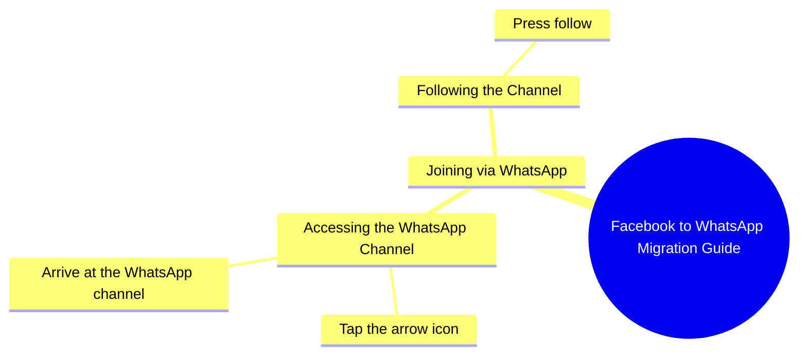

# Samina Rani Invites Followers to WhatsApp

> 🌐 **Read this in:** [English](../../en/2026-10/tiktok-transcript-5-7m-views-143k-reactions-hi-samina-rani-9c9e.md) · **中文**

> **Creator:** [@Samina Rani](https://www.tiktok.com/@Samina Rani) · **Views:** 2.3M · **Posted:** 2026-10-04 · **Niche:** marketing
>
> **TL;DR:** The hook directly acknowledges the viewer's presence on Facebook and invites them to WhatsApp, creating a personal connection and curiosity about the next step.

[Watch original video →](https://www.facebook.com/share/r/1FLyabqPAE/)

## Why This Went Viral

## 钩子（前3秒）
- **逐字开场：**“好吧，所以你在Facebook上找到我了——现在来我的WhatsApp”
- **钩子模式：**直接点名+平台迁移指令（一种“召唤”式钩子）。它从对话中途开始，仿佛在延续一段观众已经拥有的关系。
- **为什么它能阻止滑动：**它使用第二人称的暗示性指责（“تو ملی گئے ہو”=“所以你*确实*找到我了”）。观众感觉被直接点名，还有点被逮住的感觉。回报承诺（“میں آپ کو بتاتی ہوں”=“我会告诉你怎么做”）在3秒内以零铺垫成本制造了一个开放循环。

## 情绪节奏
- **节拍1——认出（0–2秒）：**“你在Facebook上找到我了”→温暖、熟悉、轻微的受宠若惊。
- **节拍2——好奇缺口（2–4秒）：**“来我的WhatsApp，我会告诉你怎么做”→未完成的指令；观众需要知道*怎么做*。
- **节拍3——微张力（4–7秒）：**“اس تیر کے نشان کے اوپر دبا کر”（“按那个箭头标志”）→观众现在正在寻找一个UI元素，身体上参与其中。
- **节拍4——缓解/解决（7–10秒）：**“آ جائیں اور فالو کر لیں”（“过来并关注”）→请求完成，张力释放。
- **高潮：**指令“اس تیر کے نشان کے اوپر دبا کر”——这是功能峰值。之前的一切都是诱饵；这才是有效载荷。
- **反转：**没有反转。“揭示”是故意反高潮的——整个视频是一个伪装成私人信息的软CTA。这种平淡正是重点：它感觉像一条私信，而不是广告。

## 关键词密度
- **فیس بک**（Facebook）——平台锚定关键词；触发跨平台推荐和搜索。
- **ووٹس ایپ / واٹس ایپ**（WhatsApp）——目的地关键词；驱动迁移意图。
- **آجاؤ / آ جائیں**（来）——重复的祈使动词；情感拉力，制造紧迫感。
- **میں آپ کو بتاتی ہوں**（我会告诉你）——承诺/权威短语；保持注意力。
- **فالو کر لیں**（关注）——转化关键词；算法触达信号。
- **تیر کے نشان**（箭头标志）——具体性关键词；让指令感觉具体且可操作。
- **ملی گئے ہو**（你找到了[我]）——亲密关键词；建立准社会亲近感。

**算法驱动因素：**فیس بک、واٹس ایپ、فالو کر لیں——这些是高意图、点名平台的标记，平台会将其呈现给已经参与这些生态系统的用户。
**情感驱动因素：**آجاؤ、ملی گئے ہو、میں بتاتی ہوں——这些营造出私人邀请的感觉，并承载留存。

## 为什么它会传播
- **它把被动观众变成“被找到”的人。**“فیس بک پہ تو ملی گئے ہو”这句话把观众重新定义为*已经在找她*的人——这颠覆了通常的求关注动态，让关注感觉像双向发现，而不是施恩。
- **它是伪装成亲密的教程。**“میں آپ کو بتاتی ہوں ووٹس ایپ پر کیسے آنا ہے”把创作者定位为帮助者，而不是推广者。观众分享“如何做”的内容，以在自己的网络中显得有用。
- **指令高度具体且视觉化。**“اس تیر کے نشان کے اوپر دبا کر”点出了一个字面上的UI元素。具体性让视频可重复观看（人们暂停、回放、跟着做）——而重复观看是强烈的排名信号。
- **请求是分层的，而不是单一的。**Facebook→WhatsApp→关注。每一步都是微承诺，完成第一步（找到她）会为第二步（关注）做铺垫。这是一个压缩在10秒内的漏斗。
- **它可作为私信的替代品。**语气模仿私人语音消息。观众会截图或转发给朋友，并说“看，这就是怎么加她”——把视频本身变成可分享的实用工具。

## 你可以借鉴什么
1. **从关系中途开始，而不是从介绍中途开始。**以“所以你终于在这里找到我了……”开头，而不是“大家好，欢迎。”假设观众已经认识你——这能压缩距离，并为你多争取2秒注意力。
2. **把你的CTA变成迷你教程。**不要说“关注我”，而要说“点上面的箭头，然后点关注——我会告诉你为什么。”点出确切的UI元素会让请求感觉像一项服务，而服务会被分享。
3. **把平台迁移当作钩子，而不是脚注。**“你在X上，但真正的内容在Y上——这是怎么过去”给观众一个移动的理由，*也*给他们一个继续看到指令落地的理由。

## Mind Map

## Full Transcript (Generated by [TokTranscript](https://toktranscript.com/?utm_source=github&utm_medium=breakdown&utm_campaign=tool_attribution))

> 📝 Transcripts on this page are auto-generated and show the first 60%. Want to transcribe any TikTok in 30 seconds and get the full version? [Try TokTranscript free →](https://toktranscript.com/?utm_source=github&utm_medium=breakdown&utm_campaign=transcript_cta)

اچھا تو فیس بک پہ تو ملی گئے ہو آجاؤ میری ووٹس ایپ پر میں آپ کو بتاتی ہوں ووٹس ایپ پر کیسے آنا ہے اس

*[Read the full transcript on TokTranscript →](https://toktranscript.com/plaza/tiktok-transcript-5-7m-views-143k-reactions-hi-samina-rani-9c9e?utm_source=github&utm_medium=breakdown&utm_campaign=transcript_full)*

## Browse More

- All [marketing](../../by-niche/zh-CN/marketing.md) breakdowns
- All [Direct Address & Platform Transition](../../by-pattern/zh-CN/hook-direct-address-platform-transition.md) examples

## Video Info

| | |
|---|---|
| Creator | [@Samina Rani](https://www.tiktok.com/@Samina Rani) |
| Original video | [https://www.facebook.com/share/r/1FLyabqPAE/](https://www.facebook.com/share/r/1FLyabqPAE/) |
| Original title | 5.7M views · 143K reactions | Hi | Samina Rani |
| Views | 2.3M (2266410) |
| Posted | 2026-10-04 |
| Duration | 0s |
| Niche | `marketing` |
| Hook pattern | `Direct Address & Platform Transition` |
| Original language | `en` (this page translated by AI) |
| Available languages | en, zh-CN |
| Generated | 2026-10-05 by [TokTranscript](https://toktranscript.com/) |

---

*This breakdown is for educational analysis under fair use. Original video © [@Samina Rani](https://www.tiktok.com/@Samina Rani). All transcripts are auto-generated and may contain errors.*

*Want to analyze your own TikToks like this? [我们用的转录工具 →](https://toktranscript.com/viral-breakdown?utm_source=github&utm_medium=breakdown&utm_campaign=footer_cta)*