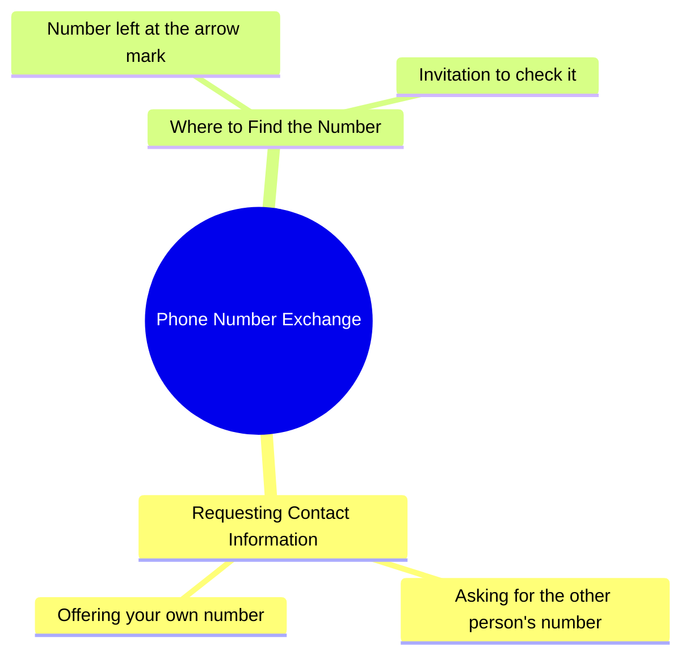

# Woman Asks for Phone Number in Hindi Reel

> 🌐 **Read this in:** [English](../../en/2026-10/tiktok-transcript-5-9m-views-103k-reactions-aaria-minnal-on-reels-5a88.md) · **中文**

> **Creator:** [@Aaria minnal](https://www.tiktok.com/@Aaria minnal) · **Views:** 2.2M · **Posted:** 2026-10-07 · **Niche:** other
>
> **TL;DR:** The hook directly asks for a number but then adds a humorous twist about leaving it on a target, creating curiosity and amusement.

[Watch original video →](https://www.facebook.com/share/r/1KQD2xkgsD/)

## Why This Went Viral

## 钩子（前3秒）
- 逐字开场：“अपना नंबर दे दीजिए या तो मेरा नंबर ले लीजिए”（“把你的号码给我，或者拿走我的号码”）
- 钩子模式：**直接命令 + 大胆提议**（以调情式挑战包装的祈使式要求）
- 为什么能止住滑动：它从对话中途开始，零铺垫，迫使观众问“等等，这是谁，她为什么要号码？”这种二选一的框架瞬间制造张力——一个陌生人提出大胆而亲密的请求在社交上是有风险的，观众会留下来看它如何发展。

## 情绪节奏
- **0–2秒——好奇/震惊：** 直白的要号码请求在语境存在之前就落地了。观众感到迷失但被钩住。
- **2–5秒——张力 + 好奇：** “मैंने तीर वाले निशान पर अपना नंबर छोड़ रखा है”（“我把我的号码留在箭头标记上了”）引入了一个谜题。这个箭头在哪里？为什么在那里？
- **5–8秒——俏皮的悬念：** “देख लीजिए”（“去看看”）把球交给观众——一个柔和的悬念，邀请参与。
- **高潮时刻：** 号码*位置*（箭头标记）的揭示——这是回报句，把一句普通的搭讪语变成一个具体的、可重复的“任务”。
- **结局：** 没有硬性结局——视频以开放邀请结束，而这正是推动评论和重看的原因。

## 关键词密度
- **नंबर**（号码）——核心情绪 + 算法关键词；重复且瞬间可识别
- **दीजिए / लीजिए**（给 / 拿）——制造二选一张力的交易动词对
- **तीर**（箭头）——好奇心关键词；不寻常、易记，推动“什么箭头？”的评论
- **निशान**（标记）——与 तीर 搭配形成具体意象
- **छोड़ रखा है**（已经留下）——暗示预谋，增加悬念
- **देख लीजिए**（去看看）——行动号召关键词，推动互动
- **अपना / मेरा**（你的 / 我的）——人称代词对比，使请求个人化

算法驱动因素：**नंबर**、**दीजिए/लीजिए**、**देख लीजिए**（高搜索/评论频率，常见于浪漫/约会内容）。
情绪拉力：**तीर**、**निशान**、**छोड़ रखा है**——这些使这句话具体且可引用，而非泛泛而谈。

## 为什么它会传播
- **这句话瞬间可引用。** “अपना नंबर दे दीजिए या तो मेरा नंबर ले लीजिए”简短、有节奏、可重复——非常适合评论区混剪和 stitch/duet 回应。
- **它创造了一个观众想要解开的谜。** “मैंने तीर वाले निशान पर अपना नंबर छोड़ रखा है”埋下了一个具体的、视觉化的谜题（一个带号码的箭头标记），观众会重看以捕捉或评论询问。
- **它颠覆了性别规范。** 女性大胆迈出第一步，颠覆了通常的约会内容动态，这在评论中既引发钦佩也引发争论。
- **开放式结尾邀请参与。** “देख लीजिए”是一个柔和的 CTA——观众回应“kahan hai arrow?”或标记朋友，喂养算法。
- **低制作，高个性。** 全部价值在于表达和措辞，因此容易模仿——模仿者成倍扩大传播。

## 你可以借鉴什么
- **以大胆的二选一要求中途开场。** 跳过介绍。从你能说的最具社交风险或最意想不到的话开始——它迫使观众留下来看语境。
- **埋下一个具体的、视觉化的谜。** 不要用模糊的挑逗，而是说出一个具体的物体或地点（“तीर वाले निशान”）。具体性使钩子令人难忘且值得评论。
- **以开放邀请结束，而非结论。** 使用像“देख लीजिए”这样的柔和 CTA，把主动权交给观众——它把被动观看转化为评论、stitch 和分享。

## Mind Map

## Full Transcript (Generated by [TokTranscript](https://toktranscript.com/?utm_source=github&utm_medium=breakdown&utm_campaign=tool_attribution))

> 📝 Transcripts on this page are auto-generated and show the first 60%. Want to transcribe any TikTok in 30 seconds and get the full version? [Try TokTranscript free →](https://toktranscript.com/?utm_source=github&utm_medium=breakdown&utm_campaign=transcript_cta)

अपना नंबर दे दीजिए या तो मेरा नंबर ले लीजिए मैंने तीर वाले 

*[Read the full transcript on TokTranscript →](https://toktranscript.com/plaza/tiktok-transcript-5-9m-views-103k-reactions-aaria-minnal-on-reels-5a88?utm_source=github&utm_medium=breakdown&utm_campaign=transcript_full)*

## Browse More

- All [other](../../by-niche/zh-CN/other.md) breakdowns
- All [Direct request with unexpected twist](../../by-pattern/zh-CN/hook-direct-request-with-unexpected-twist.md) examples

## Video Info

| | |
|---|---|
| Creator | [@Aaria minnal](https://www.tiktok.com/@Aaria minnal) |
| Original video | [https://www.facebook.com/share/r/1KQD2xkgsD/](https://www.facebook.com/share/r/1KQD2xkgsD/) |
| Original title | 5.9M views · 103K reactions | Aaria minnal on Reels |
| Views | 2.2M (2213049) |
| Posted | 2026-10-07 |
| Duration | 0s |
| Niche | `other` |
| Hook pattern | `Direct request with unexpected twist` |
| Original language | `en` (this page translated by AI) |
| Available languages | en, zh-CN |
| Generated | 2026-10-08 by [TokTranscript](https://toktranscript.com/) |

---

*This breakdown is for educational analysis under fair use. Original video © [@Aaria minnal](https://www.tiktok.com/@Aaria minnal). All transcripts are auto-generated and may contain errors.*

*Want to analyze your own TikToks like this? [TikTok 转录工具 →](https://toktranscript.com/viral-breakdown?utm_source=github&utm_medium=breakdown&utm_campaign=footer_cta)*