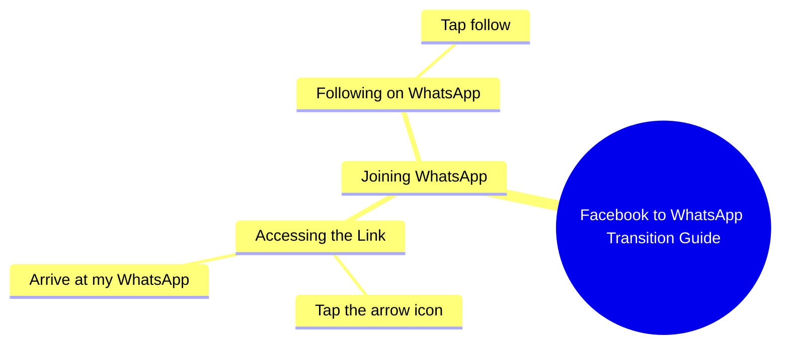

# Samina Rani Invites Followers to WhatsApp

> 🌐 **Read this in:** [English](../../en/2026-10/tiktok-transcript-6m-views-147k-reactions-hi-samina-rani-38a6.md) · **中文**

> **Creator:** [@Samina Rani](https://www.tiktok.com/@Samina Rani) · **Views:** 2.4M · **Posted:** 2026-10-07 · **Niche:** other
>
> **TL;DR:** The speaker directly addresses viewers who found her on Facebook and invites them to WhatsApp, creating a sense of exclusivity and curiosity.

[Watch original video →](https://www.facebook.com/share/r/1DJ8KUjopp/)

## Why This Went Viral

## 钩子（前3秒）
- 逐字开场：“اچھا تو فیس بک پہ تو ملی گئے ہو آجاؤ میری ووٹس ایپ پر میں آپ کو بتاتی ہوں ووٹس ایپ پر کیسے آنا ہے”（“所以你在Facebook上找到我了——来我的WhatsApp，我告诉你怎么到那儿”）
- 钩子模式：**直接点名 + 平台转移 + 教学承诺**（一种“你在这儿，现在跟我去那边”的命令式钩子）
- 为什么能阻止滑动：它以一种仿佛观众早已认识她的方式称呼观众（“تو ملی گئے ہو” / “所以你*确实*找到我了”），制造即时熟悉感和轻微的FOMO。一个*如何操作*的承诺（“میں آپ کو بتاتی ہوں کیسے آنا ہے”）让离开感觉像是错过了说明。

## 情绪节奏
- **0–2秒 — 认出/好奇：** “所以你在Facebook上找到我了”——感觉私密，像重逢。
- **2–5秒 — 轻微紧张/紧迫：** “来我的WhatsApp”——一个重定向要求制造出小小的“等等，发生了什么？”牵引力。
- **5–10秒 — 缓解/指导：** “按箭头图标，来我的WhatsApp并关注”——紧张感化解为一个简单、可执行的动作。
- **高潮：** 她说“اس تیر کے نشان کے اوپر دبا کر”（“按那个箭头图标”）的那一刻——这个具体手势就是回报；这是观众会反复回看以照做的台词。
- 没有戏剧性反转；“反转”是结构性的——一个伪装成友好聊天的软性销售漏斗。

## 关键词密度
- **ووٹس ایپ / WhatsApp**（重复3次）——主要算法 + 意图关键词；表明平台迁移。
- **فیس بک / Facebook**（1次）——语境锚点，告诉算法受众来源。
- **آجاؤ / 来**——祈使式，驱动行动。
- **فالو کر لیں / 关注**——明确的CTA关键词。
- **بتاتی ہوں / 我告诉你**——信任/承诺关键词，情绪牵引。
- **تیر کے نشان / 箭头图标**——微指令关键词；高留存驱动因素，因为观众会暂停以定位它。
- **ملی گئے ہو / 你找到我了**——亲密关键词，建立准社会连接。
- **算法触达驱动因素：** WhatsApp、Facebook、follow（算法用于分类和分发的平台 + 行动术语）。
- **情绪牵引驱动因素：** “ملی گئے ہو”、“بتاتی ہوں”（熟悉感 + 承诺）。

## 为什么它会传播
- **准社会重连框架：** “اچھا تو فیس بک پہ تو ملی گئے ہو”把观众当作早已在寻找她的人——这奉承了受众，并触发“她注意到我了”的反应，从而推动她在现有Facebook社群内的分享。
- **平台迁移即内容：** 视频的整个前提就是把受众从Facebook转移到WhatsApp——这创造了一个自我复制的循环，因为WhatsApp上的每个新关注者都有动力把视频分享给仍在Facebook上的其他人。
- **微指令留存钩子：** “اس تیر کے نشان کے اوپر دبا کر”迫使观众暂停并寻找箭头——提升观看时长和重复观看，而算法会奖励这些。
- **低摩擦CTA：** “فالو کر لیں”是一个单一、简单的请求，并以温暖的方式传达——没有复杂步骤，因此转化率（以及由此产生的互动信号）保持高位。
- **没有标题党的好奇心缺口：** “میں آپ کو بتاتی ہوں کیسے آنا ہے”这一承诺暗示有一个*方法*要学——观众会留到最后听完，提升完播率。

## 你可以借鉴什么
1. **以“你找到我了”框架开场。** 把你的受众当作一直在寻找你的人来称呼——这会制造即时亲密感，并比泛泛的“嗨大家好”更快地阻止滑动。
2. **把平台转移本身变成内容。** 如果你正在迁移受众（FB→WhatsApp、IG→newsletter、TikTok→YouTube），就把迁移做成*视频*，而不是字幕备注。它会自我复制。
3. **给出一个物理微动作。** “按箭头图标”式指令会提升留存，因为观众会暂停以执行该动作——在每个CTA视频中至少设计一个这样的时刻。

## Mind Map

## Full Transcript (Generated by [拆解你自己的 TikTok](https://toktranscript.com/?utm_source=github&utm_medium=breakdown&utm_campaign=tool_attribution))

> 📝 Transcripts on this page are auto-generated and show the first 60%. Want to transcribe any TikTok in 30 seconds and get the full version? [Try TokTranscript free →](https://toktranscript.com/?utm_source=github&utm_medium=breakdown&utm_campaign=transcript_cta)

اچھا تو فیس بک پہ تو ملی گئے ہو آجاؤ میری ووٹس ایپ پر میں آپ کو بتاتی ہوں ووٹس ایپ پر کیسے آنا ہے اس

*[Read the full transcript on TokTranscript →](https://toktranscript.com/plaza/tiktok-transcript-6m-views-147k-reactions-hi-samina-rani-38a6?utm_source=github&utm_medium=breakdown&utm_campaign=transcript_full)*

## Browse More

- All [other](../../by-niche/zh-CN/other.md) breakdowns
- All [Direct Call to Action with Curiosity](../../by-pattern/zh-CN/hook-direct-call-to-action-with-curiosity.md) examples

## Video Info

| | |
|---|---|
| Creator | [@Samina Rani](https://www.tiktok.com/@Samina Rani) |
| Original video | [https://www.facebook.com/share/r/1DJ8KUjopp/](https://www.facebook.com/share/r/1DJ8KUjopp/) |
| Original title | 6M views · 147K reactions | Hi | Samina Rani |
| Views | 2.4M (2378800) |
| Posted | 2026-10-07 |
| Duration | 0s |
| Niche | `other` |
| Hook pattern | `Direct Call to Action with Curiosity` |
| Original language | `en` (this page translated by AI) |
| Available languages | en, zh-CN |
| Generated | 2026-10-08 by [TokTranscript](https://toktranscript.com/) |

---

*This breakdown is for educational analysis under fair use. Original video © [@Samina Rani](https://www.tiktok.com/@Samina Rani). All transcripts are auto-generated and may contain errors.*

*Want to analyze your own TikToks like this? [TokTranscript →](https://toktranscript.com/viral-breakdown?utm_source=github&utm_medium=breakdown&utm_campaign=footer_cta)*