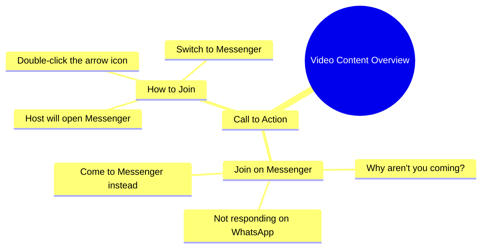

# Woman Asks Why You Don't Message Her on Messenger

> 🌐 **Read this in:** [English](../../en/2026-10/tiktok-transcript-7-8m-views-88k-reactions-trendingreels-viral-viralreels-tren-0f00.md) · **中文**

> **Creator:** [@aqsa abbas](https://www.tiktok.com/@aqsa abbas) · **Views:** 2.6M · **Posted:** 2026-10-01 · **Niche:** entertainment
>
> **TL;DR:** The hook immediately engages viewers by asking a relatable question about why people don't respond on messaging apps.

[Watch original video →](https://www.facebook.com/reel/2069553387258139/?app=fbl)

## Why This Went Viral

## 钩子（前3秒）
- 逐字开场白：“आप लोग क्यों नहीं आते हो, वाटसेप पे तो नहीं आ रहे हो, मैसिंजर पे तो आ जाओ”（“你们为什么不来？WhatsApp上不来，至少来Messenger吧”）
- 钩子模式：**直接指责 + 点名式提问**（对抗性的第二人称称呼）
- 为什么能阻止滑动：它在一场争论中途开场，对着一个未具名的“你”说话，瞬间制造出准社会关系的紧张感——观众感觉被直接点名，想知道她到底在骂*谁*、*为什么*。这种抱怨很有共鸣（在通讯软件上被无视），因此同时激发好奇心和自我认同。

## 情绪节奏
- **第1拍——对抗/好奇（0–2秒）：**“你们为什么不来？”——轻度指责，观众凑近看。
- **第2拍——升级（2–5秒）：**“WhatsApp上就是不来”——具体、熟悉的怨言；积累轻微的愧疚感/好笑感。
- **第3拍——转向指令（5–8秒）：**“来Messenger吧，在箭头标记上点两下”——从抱怨转向字面意义上的操作指南，既荒谬又好笑。
- **第4拍——高潮/爆点（8–10秒）：**“मैं मैसिंजर खुल के आती हूँ”（“我会开着来Messenger”）——这句破碎/含糊的措辞作为反转落地。语法上的怪异就是情绪峰值——这是人们引用和转发的那句话。
- **高潮时刻：**最后一句。笑点在于意外的双关含义（“我会开着来”），把一句平凡的恳求变成了可做成梗的爆点。

## 关键词密度
- **आओ / आ जाओ（来）**——重复的祈使句；驱动行动号召的能量。
- **मैसिंजर（Messenger）**——重复3次；平台名称就是算法关键词。
- **वाटसेप（WhatsApp）**——高辨识度品牌词；提升可发现性。
- **क्यों नहीं（为什么不）**——情绪钩子词；传递怨言。
- **क्लिक करो（点击）**——指令性动词；增加“操作指南”的质感。
- **तीर के निशान（箭头标记）**——视觉提示；让指令变得具体。
- **खुल के आती हूँ（开着来）**——病毒式传播短语；纯粹的情绪/梗吸引力，而非算法。

算法触达：品牌名（WhatsApp、Messenger）+ 祈使动词。情绪拉力：“kyun nahi aate ho”和最后的词语误用。

## 为什么它会传播
- **可共鸣的怨言作为切入点：**“आप लोग क्यों नहीं आते हो”映射了被无视或不得不追着别人跑的普遍感受——观众会@那些“从不回复”的朋友。
- **荒谬的具体性：**“तीर के निशान पे दो बार क्लिक करो”把模糊的恳求变成假精确的指令，读起来像无意的喜剧，并招来模仿。
- **词语误用式爆点：**“मैं मैसिंजर खुल के आती हूँ”在语法上偏离得恰到好处，制造出双关——正是那种会变成字幕、音效和合拍提示的句子。
- **第二人称称呼 = 直接互动：**每一句都在说“你”，所以观众感觉被搭话，推动评论（“main aa gaya didi”）和回复视频文化。
- **低制作、高个性：**没有铺垫，没有背景——只有原始情绪和一条令人困惑的指令。这种“真实混乱”格式极易被二次创作，并通过翻译跨语言社区传播。

## 你可以借鉴什么
- **在冲突中途开场，而非在背景中途。**用一句针对“你”的抱怨或指责开始你的视频——跳过介绍，让观众自己推断故事。
- **给一个假精确的指令。**“在箭头上点两下”式的指示既显得可操作又荒谬；它们制造评论诱饵和录屏分享。
- **设计一句可引用、略带破碎的台词。**结尾处一个语法怪异或双关的短语会成为你的音效、你的字幕和你的梗——要提前规划，不要听天由命。

## Mind Map

## Full Transcript (Generated by [我们用的转录工具](https://toktranscript.com/?utm_source=github&utm_medium=breakdown&utm_campaign=tool_attribution))

> 📝 Transcripts on this page are auto-generated and show the first 60%. Want to transcribe any TikTok in 30 seconds and get the full version? [Try TokTranscript free →](https://toktranscript.com/?utm_source=github&utm_medium=breakdown&utm_campaign=transcript_cta)

आप लोग क्यों नहीं आते हो, वाटसेप पे तो नहीं आ रहे हो, मैसिंजर पे तो आ जाओ, तीर के निशान पे द

*[Read the full transcript on TokTranscript →](https://toktranscript.com/plaza/tiktok-transcript-7-8m-views-88k-reactions-trendingreels-viral-viralreels-tren-0f00?utm_source=github&utm_medium=breakdown&utm_campaign=transcript_full)*

## Browse More

- All [entertainment](../../by-niche/zh-CN/entertainment.md) breakdowns
- All [Direct Question](../../by-pattern/zh-CN/hook-direct-question.md) examples

## Video Info

| | |
|---|---|
| Creator | [@aqsa abbas](https://www.tiktok.com/@aqsa abbas) |
| Original video | [https://www.facebook.com/reel/2069553387258139/?app=fbl](https://www.facebook.com/reel/2069553387258139/?app=fbl) |
| Original title | 7.8M views · 88K reactions | #trendingreels #viral #viralreels #trending | aqsa abbas |
| Views | 2.6M (2627056) |
| Posted | 2026-10-01 |
| Duration | 0s |
| Niche | `entertainment` |
| Hook pattern | `Direct Question` |
| Original language | `en` (this page translated by AI) |
| Available languages | en, zh-CN |
| Generated | 2026-10-02 by [TokTranscript](https://toktranscript.com/) |

---

*This breakdown is for educational analysis under fair use. Original video © [@aqsa abbas](https://www.tiktok.com/@aqsa abbas). All transcripts are auto-generated and may contain errors.*

*Want to analyze your own TikToks like this? [拆解你自己的 TikTok →](https://toktranscript.com/viral-breakdown?utm_source=github&utm_medium=breakdown&utm_campaign=footer_cta)*