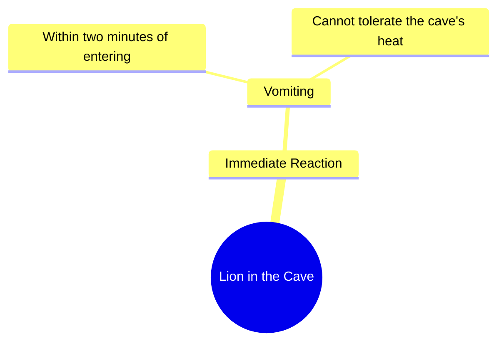

# Lion Cannot Stand Heat Inside Our Cave

> 🌐 **Read this in:** [English](../../en/2026-10/tiktok-transcript-dear-tiktok-please-don-t-underview-my-videos-foryoupage-fyp-e308.md) · **中文**

> **Creator:** [@kamana_writex](https://www.tiktok.com/@kamana_writex) · **Views:** 252.0K · **Posted:** 2026-10-02 · **Niche:** other
>
> **TL;DR:** The unexpected claim that a lion vomits within two minutes grabs attention immediately.

[Watch original video →](https://vt.tiktok.com/ZSb5N4Wqd/)

## Why This Went Viral

## 钩子（前3秒）
- 逐字开场：“شیر جب ہماری گفا میں آتا ہے ہاں تو دو منٹ میں ہی الٹی کرنے لگتا ہے”（“当狮子进入我们的洞穴时，仅仅两分钟内它就开始呕吐。”）
- 钩子模式：**反差 + 大胆断言**——食物链顶端的捕食者被像*热量*这样被动的东西瞬间击败。
- 为什么能阻止滑动：它在三秒内颠覆了一个普世的权力等级（狮子 = 顶级捕食者 → 狮子 = 呕吐的受害者）。大脑无法将“狮子”与“两分钟内呕吐”协调起来，所以它会留下来解决这个矛盾。

## 情绪节奏
- **节拍1 – 好奇（0–2秒）：** “شیر… ہماری گفا میں آتا ہے”——“我们”是谁，为什么狮子会进入洞穴？
- **节拍2 – 荒诞画面 / 微转折（2–4秒）：** “الٹی کرنے لگتا ہے”——呕吐的细节作为震惊喜剧的尖峰落下。
- **节拍3 – 张力积累（4–7秒）：** “ہماری گفا کی گرمی”——洞穴的热量被引入为看不见的武器。
- **节拍4 – 高潮 / 爆点（7–10秒）：** “بیچارہ شیر بھی برداشت نہیں کر پاتا”——**بیچارہ**（“可怜的东西”）这个词把狮子从怪物翻转为受害者。这是情绪峰值。
- **节拍5 – 共鸣：** 对洞穴致命性的自豪——说话者的环境比任何捕食者都强大。观众感受到替代性的支配感。
- **高潮时刻：** “بیچارہ شیر”——对狮子的怜悯一击。之前的一切都是为这个反转做铺垫。

## 关键词密度
- **شیر**（狮子）——驱动传播；高搜索、高情绪的动物关键词。
- **گفا / غار**（洞穴）——锚定场景；让故事令人难忘的不寻常词汇。
- **گرمی**（热量）——因果机制；承载“为什么”。
- **الٹی**（呕吐）——震惊关键词；驱动分享和评论。
- **دو منٹ**（两分钟）——让断言感觉像事实的具体性。
- **برداشت نہیں کر پاتا**（无法忍受）——失败短语；情绪拉力。
- **بیچارہ**（可怜的东西）——共情翻转；情绪拉力。
- **ہماری**（我们的）——部落归属感；创造内群体共鸣。
- **算法驱动因素：** شیر、الٹی、گرمی——触发评论的高互动名词（“这是真的吗？”）。
- **情绪驱动因素：** بیچارہ、ہماری、برداشت——建立自豪、怜悯和归属感。

## 为什么它会传播
- **一句话中的权力反转：** “شیر… الٹی کرنے لگتا ہے”把最强壮的动物压缩成最虚弱的状态——这是片段中最具分享性的画面。
- **具体性让荒诞感成立：** “دو منٹ میں ہی”（仅仅两分钟内）让一个难以置信的断言听起来像是经过衡量和观察的，而不是夸张的。
- **共情翻转制造评论诱饵：** “بیچارہ شیر”邀请观众争论——有人笑，有人为狮子辩护，有人问这是不是真的。三种反应都在喂养算法。
- **部落自豪钩子：** “ہماری گفا”（我们的洞穴）把说话者的环境框定为优于自然界的顶级捕食者——来自相似地区的观众会将其作为身份内容分享。
- **自包含的爆点：** 整个片段是一个铺垫 + 一个转折，所以它可引用、可复述、适合循环——不需要背景就能欣赏。

## 你可以借鉴什么
1. **以权力反转开场。** 拿出你领域里最强的东西（一位CEO、一位冠军、一位天才），在第一行展示它被某种微不足道的东西击败。矛盾 = 留存。
2. **使用一个荒诞、具体的细节。** “两分钟内呕吐”胜过“狮子受不了”。具体、身体化、略带恶心的细节才是会被截图和重复的东西。
3. **以共情翻转结尾。** “بیچارہ”这个词用一个音节把反派变成受害者。在你的故事中找到那个时刻，让观众对他们刚刚害怕的东西感到*抱歉*——那就是分享触发器。

## Mind Map

## Full Transcript (Generated by [TokTranscript 转录工具](https://toktranscript.com/?utm_source=github&utm_medium=breakdown&utm_campaign=tool_attribution))

> 📝 Transcripts on this page are auto-generated and show the first 60%. Want to transcribe any TikTok in 30 seconds and get the full version? [Try TokTranscript free →](https://toktranscript.com/?utm_source=github&utm_medium=breakdown&utm_campaign=transcript_cta)

شیر جب ہماری گفا میں آتا ہے ہاں تو دو منٹ میں ہی الٹی کرنے لگتا ہے ہمار

*[Read the full transcript on TokTranscript →](https://toktranscript.com/plaza/tiktok-transcript-dear-tiktok-please-don-t-underview-my-videos-foryoupage-fyp-e308?utm_source=github&utm_medium=breakdown&utm_campaign=transcript_full)*

## Browse More

- All [other](../../by-niche/zh-CN/other.md) breakdowns
- All [shocking fact](../../by-pattern/zh-CN/hook-shocking-fact.md) examples

## Video Info

| | |
|---|---|
| Creator | [@kamana_writex](https://www.tiktok.com/@kamana_writex) |
| Original video | [https://vt.tiktok.com/ZSb5N4Wqd/](https://vt.tiktok.com/ZSb5N4Wqd/) |
| Original title | Dear Tiktok please Don't Underview My Videos~😂🤣😀🤣#foryoupage #fypシ #f... |
| Views | 252.0K (252000) |
| Posted | 2026-10-02 |
| Duration | 0s |
| Niche | `other` |
| Hook pattern | `shocking fact` |
| Original language | `en` (this page translated by AI) |
| Available languages | en, zh-CN |
| Generated | 2026-10-03 by [TokTranscript](https://toktranscript.com/) |

---

*This breakdown is for educational analysis under fair use. Original video © [@kamana_writex](https://www.tiktok.com/@kamana_writex). All transcripts are auto-generated and may contain errors.*

*Want to analyze your own TikToks like this? [TokTranscript →](https://toktranscript.com/viral-breakdown?utm_source=github&utm_medium=breakdown&utm_campaign=footer_cta)*