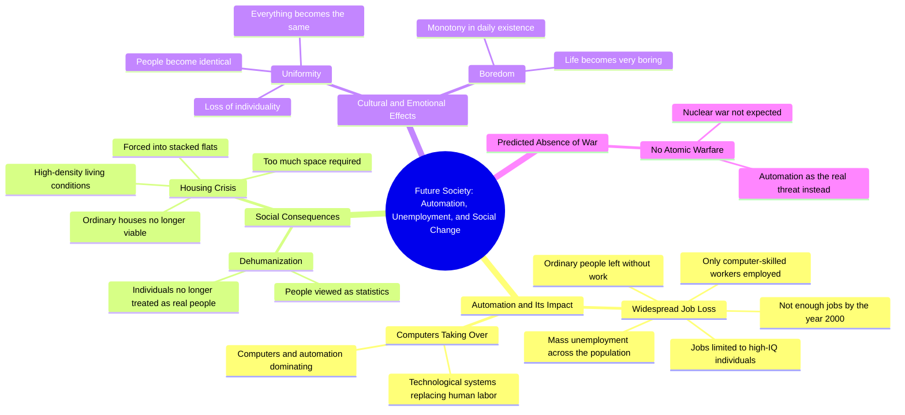

# 1966 Kids Predict Automation and Job Loss

> 🌐 **Read this in:** [English](../../en/2026-10/tiktok-transcript-future-according-to-kids-documentary-from-1966-ai-future-une-5eea.md) · **中文**

> **Creator:** [@wersalek420](https://www.tiktok.com/@wersalek420) · **Views:** 1.8M · **Posted:** 2026-10-03 · **Niche:** other
>
> **TL;DR:** It flips the common fear of nuclear war into a more relatable, creeping fear of automation, instantly grabbing attention.

[Watch original video →](https://vt.tiktok.com/ZSbuMnvwM/)

## Why This Went Viral

## 钩子（前3秒）
- **逐字开场白：**“我不认为会有原子战争，但我认为会有所有这些自动化。”
- **钩子模式：**对比 + 大胆断言（拒绝预期的末日，代之以一种更安静、更隐蔽的末日）。
- **为什么它能让人停下滚动：**它劫持了一种熟悉的恐惧（核战争），并在同一口气中换入了一种*不同*的威胁。观众的大脑会登记“这不是我预期的那种末日”——一个未解决的模式，要求听下一句。随意、未经打磨的表达（“我不认为……但我认为”）读起来像是真正的预测，而不是脚本化内容。

## 情绪节奏
- **0–3秒——迷失/好奇：**核战争被否定，自动化被点名。张力被设定，却没有解决。
- **3–12秒——恐惧升级：**“人们会失去工作”“更多地被视为统计数据，而不是实际的人”。去人性化的节拍落在这里。
- **12–22秒——幽闭意象：**“公寓一层层堆叠在一起”“非常无聊”“一切都会一样”。感官化、视觉化、反乌托邦——共鸣在这里最强烈。
- **22–35秒——冷酷逻辑：**“高智商……工作计算机……其他人就是不会有工作。”转折：杀死你的不是暴力，而是*冗余*。
- **高潮时刻：**“就是不会有工作留给你。”直白、第二人称的崩塌——观众被直接点名为过时者。

## 关键词密度
- **自动化 / 计算机**——算法触达（科技恐慌类SEO词）。
- **工作 / 失业 / 没有工作**——情绪拉力最高；普遍焦虑锚点。
- **人们**（重复6次以上）——把利害关系框定为人性，而非经济。
- **统计数据**——转录中最锋利的一个词；承载去人性化论点。
- **高智商 / HQ**——令人记住的口误，传递真实性（未照稿说话的讲者）。
- **公寓 / 一层层堆叠在一起**——视觉关键词；推动评论区意象。
- **无聊 / 一样**——被低估；把恐惧转化为*倦怠*，一种更罕见的情感调式。
- **2000年**——时间戳锚点，让预测可被证伪并可分享。

## 为什么它会传播
- **这是一个部分成真的“失败预言”。**“2000年”这个时间戳让观众可以把预测与现实对照——自动化焦虑、零工工作、AI裁员。评论区变成记分牌。
- **它把末日重新框定为无聊。**“它会非常无聊，一切都会一样”是人们会引用的话。它反直觉——反乌托邦是单调，而不是烈火。
- **第二人称直击。**“就是不会有工作留给你”把宏观预测变成个人判决。这就是截图金句。
- **未经打磨的真实感。**“HQ”口误、那些“呃”、那些连跑句——观众比相信精修AI配音版更相信它。它读起来像过去的一个真实的人在警告现在。
- **AI话语的预回声。**2024–2025年的每一场“自动化会夺走工作”辩论，都会回溯性地验证这段视频，所以它会在每个新闻周期中重新浮现。

## 你可以偷什么
- **开场时拒绝显而易见的恐惧，然后点出真正的恐惧。**“你该担心的不是X——而是Y。”瞬间对比，瞬间留存。
- **以第二人称判决收尾。**把你的论点转化成一句指向观众的话：“……而且它正冲*你*而来。”这就是你的可分享金句。
- **让不完美留下来。**一个口误、一次迟疑、一句连跑句，都表明一个真实的人。在口播类内容中，精修会杀死病毒式传播。

## Mind Map

## Full Transcript (Generated by [TikTok 转录工具](https://toktranscript.com/?utm_source=github&utm_medium=breakdown&utm_campaign=tool_attribution))

> 📝 Transcripts on this page are auto-generated and show the first 60%. Want to transcribe any TikTok in 30 seconds and get the full version? [Try TokTranscript free →](https://toktranscript.com/?utm_source=github&utm_medium=breakdown&utm_campaign=transcript_cta)

I don't think there is going to be atomic warfare, but I think there's is going to be all this automation. People are going to be out of work and a great population, and I think something has to be done about it. I think it'll be a, um, people will be regarded more as statistics and as actual people. People can't live in, wouldn't be able to live in ordinary houses because I would take up too much room. It'd have to be in flats piled on top of one another. I think it's going to be very boring, and everything will be the same. I mean, people will be the same, things w

*[Read the full transcript on TokTranscript →](https://toktranscript.com/plaza/tiktok-transcript-future-according-to-kids-documentary-from-1966-ai-future-une-5eea?utm_source=github&utm_medium=breakdown&utm_campaign=transcript_full)*

## Browse More

- All [other](../../by-niche/zh-CN/other.md) breakdowns
- All [Expectation Subversion](../../by-pattern/zh-CN/hook-expectation-subversion.md) examples

## Video Info

| | |
|---|---|
| Creator | [@wersalek420](https://www.tiktok.com/@wersalek420) |
| Original video | [https://vt.tiktok.com/ZSbuMnvwM/](https://vt.tiktok.com/ZSbuMnvwM/) |
| Original title | Future according to kids. Documentary from 1966. #ai #future #unemplo... |
| Views | 1.8M (1800000) |
| Posted | 2026-10-03 |
| Duration | 0s |
| Niche | `other` |
| Hook pattern | `Expectation Subversion` |
| Original language | `en` (this page translated by AI) |
| Available languages | en, zh-CN |
| Generated | 2026-10-04 by [TokTranscript](https://toktranscript.com/) |

---

*This breakdown is for educational analysis under fair use. Original video © [@wersalek420](https://www.tiktok.com/@wersalek420). All transcripts are auto-generated and may contain errors.*

*Want to analyze your own TikToks like this? [免费 TikTok 文稿生成器 →](https://toktranscript.com/viral-breakdown?utm_source=github&utm_medium=breakdown&utm_campaign=footer_cta)*