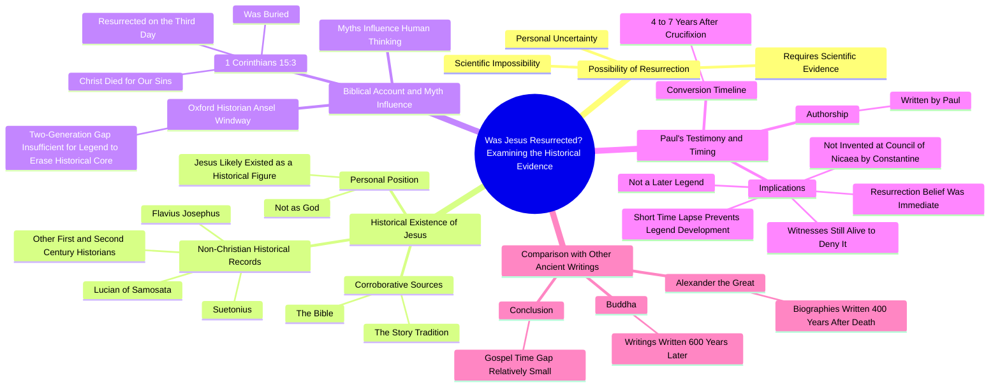

# Street Interview: Was Jesus Resurrected?

> 🌐 **Read this in:** [English](../../en/2026-10/tiktok-transcript-jes-s-resucit-dios-biblia-paratii-entrevista-tiktok-2996.md) · **中文**

> **Creator:** [@oficial.angelrodriguez](https://www.tiktok.com/@oficial.angelrodriguez) · **Views:** 529.6K · **Posted:** 2026-10-02 · **Niche:** entertainment
>
> **TL;DR:** The hook immediately engages viewers with a controversial and personal question, sparking curiosity and debate.

[Watch original video →](https://vt.tiktok.com/ZSbf4LjQr/)

## Why This Went Viral

## 钩子（前3秒）
- 开场白，逐字引用：“你认为耶稣复活了吗？对1个人来说，这是不可能的。”
- 钩子模式：**直接提问 + 立即大胆反驳**（问题与矛盾组合）。
- 为何能阻止滑动：它在两秒内迫使观众做出二元自我回答（“是/否”），然后演讲者立即否定前提。这制造了认知失调——观众要么同意并留下来看论证，要么不同意并留下来反驳。两种反应都增加了观看时间。

## 情绪节奏
- **0–5秒 — 挑衅：**“对1个人来说，这是不可能的。”观众被诱入防御或好奇的状态。
- **5–20秒 — 让步循环：**“我无法知道……我需要1个证据。”演讲者显得中立/怀疑，同时解除宗教观众和无神论观众的武装。
- **20–45秒 — 张力铺垫：**“耶稣存在过吗？”+“不是作为1个神。”将观众分成两个阵营，双方现在都想要答案。
- **45–90秒 — 证据堆叠：**约瑟夫斯、卢西亚诺、苏埃托尼乌斯，然后是《哥林多前书》15:3。悬念通过累积建立——“证据能站得住脚吗？”
- **90–110秒 — 转折/高潮：**“这是巴勃罗写的……在钉十字架后4到7年。”这是**高潮时刻**——那个“抓到了”的瞬间，将整个视频从“耶稣是否存在”重新定义为“复活是早期信仰，而非后来的传说。”
- **110–130秒 — 释放/回报：**亚历山大（400年）和佛陀（600年）的比较。张力释放为令人满意的“所以时间线其实很短”的结论。
- **共鸣节拍：**“证人还活着，可以否认它”——作为情感/法律上的重击落地。

## 关键词密度
- **耶稣**（最高频率——为算法主题匹配锚定话题）
- **复活/复活了**（核心搜索词，驱动宗教+历史搜索流量）
- **证据/科学/证明**（驱动怀疑派观众的触及；发出“理性”框架的信号）
- **圣经/《哥林多前书》15:3/巴勃罗（保罗）**（小众权威标记——吸引基督教观众）
- **传说/神话**（框架关键词，使论证感觉学术而非说教）
- **1/2/4到7年/400/600**（数字——留存引擎；每个数字重置注意力）
- **历史学家/约瑟夫斯/苏埃托尼乌斯**（可信度关键词——算法“教育”信号）
- **证人/活着/否认**（情感拉力——法律剧词汇）

算法触及驱动因素：*耶稣、复活、证据、历史学家*（搜索+主题聚类）。
情感拉力驱动因素：*证人还活着可以否认、传说、不可能*（这些是被重播和在评论中引用的内容）。

## 为何传播
- **它武器化了“我只是在提问”的框架。**像“我无法知道”和“我需要1个证据”这样的台词让信徒和怀疑者都觉得视频站在他们一边——所以双方都会分享它。
- **转折是一个具名来源的揭示。**“这是巴勃罗写的”将模糊的神学主张转化为可核查的事实。可分享的内容需要一个“等等，真的吗？”的时刻——这就是它。
- **数字创造留存脚手架。**“4到7年”、“400年”、“600年”——每个数字都是一个迷你钩子，重置注意力，使比较感觉是经验性的而非情感性的。
- **它预先化解了最强的反驳。**“证人还活着，可以否认它”回答了观众即将在评论中打出的反对意见——这消除了“实际上”的回复，并提升了评论区的认同。
- **它从宗教外部借用权威。**约瑟夫斯、苏埃托尼乌斯、“牛津历史学家”——这发出“世俗证据”的信号，使该片段可在非宗教空间分享（历史、辩论、无神论、护教学社区同时覆盖）。

## 你可以借鉴什么
- **以问题开场，然后立即反驳它。**问题将双方拉入；反驳让他们留下来看你如何解决它。
- **将具名来源堆叠为视觉/语言节拍。**每个专有名词（约瑟夫斯、苏埃托尼乌斯、《哥林多前书》15:3）都是一个留存检查点——观众等待下一个。
- **以一个重新定义整个论证的比较数字结尾。**“400年 vs. 4–7年”是可分享的金句。构建你的视频，使最后15秒包含一个单一的、可引用的数字对比。

## Mind Map

## Full Transcript (Generated by [拆解你自己的 TikTok](https://toktranscript.com/?utm_source=github&utm_medium=breakdown&utm_campaign=tool_attribution))

> 📝 Transcripts on this page are auto-generated and show the first 60%. Want to transcribe any TikTok in 30 seconds and get the full version? [Try TokTranscript free →](https://toktranscript.com/?utm_source=github&utm_medium=breakdown&utm_campaign=transcript_cta)

Do you think Jesus was resurrected? It is not possible for 1 human being. I cannot know. To believe me, I would need 1 piece of evidence, but make it scientific. It is impossible for it to happen. To test the resurrection, we should accept some previous premises, Did Jesus exist? I believe that it could have existed, but that what was later created It still doesn't have much to do with what really happened. I feel that Jesus did exist, but not as 1 God. To demonstrate the existence of Jesus we should appeal to 2 corroborative sources. The first is the story and the second the Bible. If Jesus were only to appear in the Bible, we might think it was the invention of its authors. However, there is 1 extensive record of historians. not Christians who prove it, first and second century historians as were Flavius Josephus,, Luciano Linio, young Suetonius, among many others. Now, what does the Bible say? Do you think the original story was influenced by myths? Man, of course, in the end, the myths They have always influenced 1 lot in the way people think. Oxford historian Ansel Windway, says 2-generation El Paso is not enough time for 1 legend to erase 1 core of historical truth. If we go to the Bible to the First of Corinthians 15:3, we will find the next appointment, Christ died for our sins, was buried and resurrec

*[Read the full transcript on TokTranscript →](https://toktranscript.com/plaza/tiktok-transcript-jes-s-resucit-dios-biblia-paratii-entrevista-tiktok-2996?utm_source=github&utm_medium=breakdown&utm_campaign=transcript_full)*

## Browse More

- All [entertainment](../../by-niche/zh-CN/entertainment.md) breakdowns
- All [Provocative Question](../../by-pattern/zh-CN/hook-provocative-question.md) examples

## Video Info

| | |
|---|---|
| Creator | [@oficial.angelrodriguez](https://www.tiktok.com/@oficial.angelrodriguez) |
| Original video | [https://vt.tiktok.com/ZSbf4LjQr/](https://vt.tiktok.com/ZSbf4LjQr/) |
| Original title | ¿Jesús resucitó? #dios #biblia #paratii #entrevista #tiktok  |
| Views | 529.6K (529600) |
| Posted | 2026-10-02 |
| Duration | 0s |
| Niche | `entertainment` |
| Hook pattern | `Provocative Question` |
| Original language | `en` (this page translated by AI) |
| Available languages | en, zh-CN |
| Generated | 2026-10-02 by [TokTranscript](https://toktranscript.com/) |

---

*This breakdown is for educational analysis under fair use. Original video © [@oficial.angelrodriguez](https://www.tiktok.com/@oficial.angelrodriguez). All transcripts are auto-generated and may contain errors.*

*Want to analyze your own TikToks like this? [TikTok 转录工具 →](https://toktranscript.com/viral-breakdown?utm_source=github&utm_medium=breakdown&utm_campaign=footer_cta)*