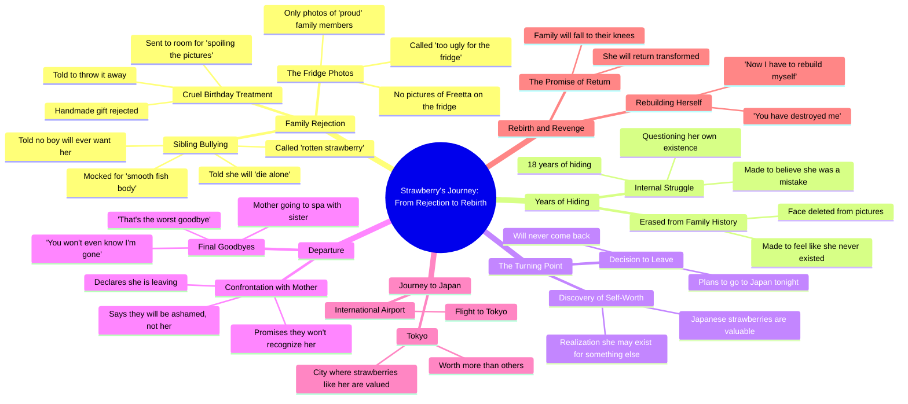

# Fruit Drama: Mom Rejects Ugly Daughter

> 🌐 **Read this in:** [English](../../en/2026-10/tiktok-transcript-partie-1-la-diff-rence-de-fraisita-fruitdrama-fruitanimation-498a.md) · **中文**

<a href="https://www.tiktok.com/@fruit.drama.studi6/video/7632734366652779798?_r=1&u_code=f613i7e0907b2d&preview_pb=0&sharer_language=fr&_d=f613hjj4fjgmh1&share_item_id=7632734366652779798&source=h5_m&timestamp=1791585537&user_id=7693143281581065238&sec_user_id=MS4wLjABAAAA0zLR9nqeHy-bmAVfb-b17Qq32YbVfTmyajtdWZNrx0lhxlRlVSfmU1p6D01BZfs5&social_share_type=0&utm_source=copy&utm_campaign=client_share&utm_medium=android&share_iid=7693737648188426017&share_link_id=a76c0028-88ed-433c-adee-8059fbdaca65&share_app_id=1233&ugbiz_name=MAIN&ug_btm=b2878%2Cb2878&sp_root_share_link_id=a76c0028-88ed-433c-adee-8059fbdaca65&link_reflow_popup_iteration_sharer=%7B%22click_empty_to_play%22%3A1%2C%22dynamic_cover%22%3A1%2C%22follow_to_play_duration%22%3A-1.0%2C%22profile_clickable%22%3A1%7D&panel_source_v2=share_panel&share_enter_from=others_homepage&item_author_type=2&enable_checksum=1&sp_level=1&sp_root_u=f613i7e0907b2d&sp_root_d=f613hjj4fjgmh1" target="_blank"></a>

> **Creator:** [@fruit.drama.studi6](https://www.tiktok.com/@fruit.drama.studi6) · **Views:** 15.4M · **Posted:** 2026-10-09 · **Niche:** entertainment
>
> **TL;DR:** Opens with a poignant question that immediately reveals family rejection and sparks curiosity.

[Watch original video →](https://www.tiktok.com/@fruit.drama.studi6/video/7632734366652779798?_r=1&u_code=f613i7e0907b2d&preview_pb=0&sharer_language=fr&_d=f613hjj4fjgmh1&share_item_id=7632734366652779798&source=h5_m&timestamp=1791585537&user_id=7693143281581065238&sec_user_id=MS4wLjABAAAA0zLR9nqeHy-bmAVfb-b17Qq32YbVfTmyajtdWZNrx0lhxlRlVSfmU1p6D01BZfs5&social_share_type=0&utm_source=copy&utm_campaign=client_share&utm_medium=android&share_iid=7693737648188426017&share_link_id=a76c0028-88ed-433c-adee-8059fbdaca65&share_app_id=1233&ugbiz_name=MAIN&ug_btm=b2878%2Cb2878&sp_root_share_link_id=a76c0028-88ed-433c-adee-8059fbdaca65&link_reflow_popup_iteration_sharer=%7B%22click_empty_to_play%22%3A1%2C%22dynamic_cover%22%3A1%2C%22follow_to_play_duration%22%3A-1.0%2C%22profile_clickable%22%3A1%7D&panel_source_v2=share_panel&share_enter_from=others_homepage&item_author_type=2&enable_checksum=1&sp_level=1&sp_root_u=f613i7e0907b2d&sp_root_d=f613hjj4fjgmh1)

## Why This Went Viral

## 钩子（前3秒）
- **逐字开场白：**“妈妈，为什么冰箱上没有我的照片，因为照片里的是我们引以为傲的人”
- **钩子模式：**冷开场情感对峙——一个孩子向父母提出一个赤裸裸的、指责性的问题。这是一个**场景/冲突钩子**（直接切入家庭残酷现场），而不是一个主张或对镜提问。
- **为什么能让人停下滑动：**它把观众直接丢进一场正在发生的家庭排斥中，没有任何铺垫。“照片里的是我们引以为傲的人”这句话暗示说话者*不是*其中之一——在2秒内就能被解读为“不被爱的孩子”。冰箱是一个普遍理解的家庭归属地位象征，所以伤口在观众决定是否继续观看之前就已经扎下。

## 情绪节奏
- **好奇**（0–3秒）：为什么没有照片？说话的人是谁？
- **紧张**（3–15秒）：残酷升级——“太丑了不配放冰箱”“妈妈很丑，我可以把它扔掉”“回你房间等着，你毁了照片。”
- **羞辱高峰**（15–25秒）：“毛衣下光滑的鱼身”/“腐烂一天的草莓”这些侮辱——通过反复出现的贬称（“草莓”）进行非人化。
- **绝望→决心**（25–40秒）：“你会孤独死去”→“他们把照片里我的脸删掉了，好像我从未存在过”→转折：“也许我存在是为了别的什么。”
- **反转/揭示**（40–50秒）：“在日本有像我这样的草莓，它们价值连城”——侮辱变成了身份和资产。
- **高潮：**“我今晚要去日本，永远不会回来”——逃离宣言。这是情绪顶点；之后的一切都是复仇幻想的收尾。
- **结局/尾标**（50秒–结束）：“我回来的那天，你会跪在我面前”——对未来反转的承诺，这正是让观众想要续集的原因。

## 关键词密度
- **“草莓”**——核心母题；同时承载侮辱和救赎。
- **“妈妈/妈咪”**——锚定家庭冲突框架。
- **“丑”**——核心伤口。
- **“照片/相片/冰箱”**——排斥的具体象征。
- **“日本/东京”**——逃离和地位反转的目的地。
- **“藏/躲/隐藏”**——羞耻主题。
- **“价值/财富/比其他人更值钱”**——价值反转的回报。
- **“再见”**——转折点标记。
- **“羞愧/后悔”**——复仇承诺词汇。
- **算法驱动词：**“日本”“东京”“草莓”——高搜索量、高视觉性、容易配字幕/标签，而且“草莓”是一个钩子词，让视频可搜索、可 meme 化。
- **情绪驱动词：**“妈妈”“丑”“躲藏”“羞愧”——这些是让观众*感受*并评论的词（“这就是我的童年”）。

## 为什么它会传播
- **普遍的家庭排斥伤口，极度具体的呈现方式。**“为什么冰箱上没有我的照片”和“他们把照片里我的脸删掉了，好像我从未存在过”把私人痛苦变成了可分享、可识别的场景——观众会 tag 那些“懂”的朋友。
- **侮辱变成了品牌。**“草莓”被反复用作贬称（“腐烂一天的草莓”“没有男孩会想要一颗没有籽的草莓”），然后被翻转成炫耀（“在日本有像我这样的草莓，它们价值连城”）。这种反转就是可分享的转折。
- **干净、可引用的复仇弧线。**“我今晚要去日本，永远不会回来”和“你会跪在我面前”是截图级台词——专为评论、合拍和拼接而设计。
- **为续集量身打造的悬念结尾。**“下次你见到我时，不会再是这样”和机场场景（“国际机场飞往东京的航班”）让转变悬而未决，推动关注、收藏和第二部分需求。
- **高对比度的情绪极性。**残酷（“你毁了照片”“你会孤独死去”）vs. 自我价值（“也许我存在是为了别的什么”“价值连城”）制造出那种能触发算法完播率信号的剧烈反差。

## 你可以借鉴什么
- **从冲突内部开始，而不是之前。**从最痛苦的那句台词开始（“为什么冰箱上没有我的照片”）——没有背景，没有介绍。让观众自己跟上。
- **给伤口一个可重复的象征。**选一个词或物件（这里是“草莓”），把它同时用作侮辱*和*救赎。单一母题让视频可引用、可搜索、可 meme 化。
- **以承诺结尾，而不是解决。**用未来时态的威胁或转变收尾（“我回来的那天，你会跪在我面前”），这样观众就需要下一个视频，算法也能获得一个关注。

## Mind Map

## Full Transcript (Generated by [TokTranscript 转录工具](https://toktranscript.com/?utm_source=github&utm_medium=breakdown&utm_campaign=tool_attribution))

> 📝 Transcripts on this page are auto-generated and show the first 60%. Want to transcribe any TikTok in 30 seconds and get the full version? [Try TokTranscript free →](https://toktranscript.com/?utm_source=github&utm_medium=breakdown&utm_campaign=transcript_cta)

mom why don't you have pictures of me on the fridge because the photos we are the ones we are proud of my dear mommy is right you are too ugly for the fridge happy birthday freetta I made your gift myself mom is ugly I can throw it away of course my dear and you go wait in your room you spoil the pictures look at my so-called sister tries to hide his smooth fish body under his sweater rotten 1 day strawberry 1 day you will regret every word no boy will ever want a strawberry without a seed you will die alone my poor 18 years hiding they deleted my face from the pictures as if I had never existed maybe I exist for something else in Japan there are strawberries like me and they are worth 1 fortune all my life I've been hiding here all my life they made me think I was a mistake I'm going to Japan tonight and I will never come back like before mommy strawberry you told

*[Read the full transcript on TokTranscript →](https://toktranscript.com/plaza/tiktok-transcript-partie-1-la-diff-rence-de-fraisita-fruitdrama-fruitanimation-498a?utm_source=github&utm_medium=breakdown&utm_campaign=transcript_full)*

## Browse More

- All [entertainment](../../by-niche/zh-CN/entertainment.md) breakdowns
- All [Question-Answer Emotional Hook](../../by-pattern/zh-CN/hook-question-answer-emotional-hook.md) examples

## Video Info

| | |
|---|---|
| Creator | [@fruit.drama.studi6](https://www.tiktok.com/@fruit.drama.studi6) |
| Original video | [https://www.tiktok.com/@fruit.drama.studi6/video/7632734366652779798?_r=1&u_code=f613i7e0907b2d&preview_pb=0&sharer_language=fr&_d=f613hjj4fjgmh1&share_item_id=7632734366652779798&source=h5_m&timestamp=1791585537&user_id=7693143281581065238&sec_user_id=MS4wLjABAAAA0zLR9nqeHy-bmAVfb-b17Qq32YbVfTmyajtdWZNrx0lhxlRlVSfmU1p6D01BZfs5&social_share_type=0&utm_source=copy&utm_campaign=client_share&utm_medium=android&share_iid=7693737648188426017&share_link_id=a76c0028-88ed-433c-adee-8059fbdaca65&share_app_id=1233&ugbiz_name=MAIN&ug_btm=b2878%2Cb2878&sp_root_share_link_id=a76c0028-88ed-433c-adee-8059fbdaca65&link_reflow_popup_iteration_sharer=%7B%22click_empty_to_play%22%3A1%2C%22dynamic_cover%22%3A1%2C%22follow_to_play_duration%22%3A-1.0%2C%22profile_clickable%22%3A1%7D&panel_source_v2=share_panel&share_enter_from=others_homepage&item_author_type=2&enable_checksum=1&sp_level=1&sp_root_u=f613i7e0907b2d&sp_root_d=f613hjj4fjgmh1](https://www.tiktok.com/@fruit.drama.studi6/video/7632734366652779798?_r=1&u_code=f613i7e0907b2d&preview_pb=0&sharer_language=fr&_d=f613hjj4fjgmh1&share_item_id=7632734366652779798&source=h5_m&timestamp=1791585537&user_id=7693143281581065238&sec_user_id=MS4wLjABAAAA0zLR9nqeHy-bmAVfb-b17Qq32YbVfTmyajtdWZNrx0lhxlRlVSfmU1p6D01BZfs5&social_share_type=0&utm_source=copy&utm_campaign=client_share&utm_medium=android&share_iid=7693737648188426017&share_link_id=a76c0028-88ed-433c-adee-8059fbdaca65&share_app_id=1233&ugbiz_name=MAIN&ug_btm=b2878%2Cb2878&sp_root_share_link_id=a76c0028-88ed-433c-adee-8059fbdaca65&link_reflow_popup_iteration_sharer=%7B%22click_empty_to_play%22%3A1%2C%22dynamic_cover%22%3A1%2C%22follow_to_play_duration%22%3A-1.0%2C%22profile_clickable%22%3A1%7D&panel_source_v2=share_panel&share_enter_from=others_homepage&item_author_type=2&enable_checksum=1&sp_level=1&sp_root_u=f613i7e0907b2d&sp_root_d=f613hjj4fjgmh1) |
| Original title | Partie 1 | La différence de Fraisita | #fruitdrama #fruitanimation #f... |
| Views | 15.4M (15400000) |
| Posted | 2026-10-09 |
| Duration | 0s |
| Niche | `entertainment` |
| Hook pattern | `Question-Answer Emotional Hook` |
| Original language | `en` (this page translated by AI) |
| Available languages | en, zh-CN |
| Generated | 2026-10-10 by [TokTranscript](https://toktranscript.com/) |

---

*This breakdown is for educational analysis under fair use. Original video © [@fruit.drama.studi6](https://www.tiktok.com/@fruit.drama.studi6). All transcripts are auto-generated and may contain errors.*

*Want to analyze your own TikToks like this? [拆解你自己的 TikTok →](https://toktranscript.com/viral-breakdown?utm_source=github&utm_medium=breakdown&utm_campaign=footer_cta)*