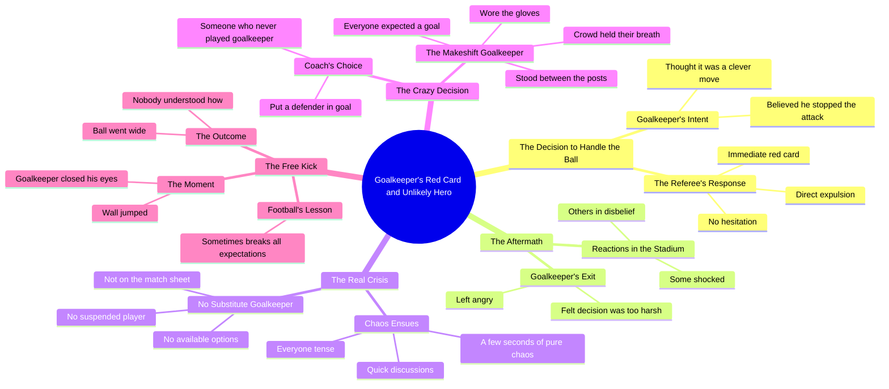

# Goalkeeper Sent Off With No Substitute on Bench

> 🌐 **Read this in:** [English](../../en/2026-10/tiktok-transcript-video-042a.md) · **中文**

> **Creator:** [@kickoffkoora](https://www.tiktok.com/@kickoffkoora) · **Views:** 5.0M · **Posted:** 2026-10-07 · **Niche:** entertainment
>
> **TL;DR:** Sets up a relatable moment of overconfidence that immediately grabs attention.

[Watch original video →](https://vm.tiktok.com/ZN8kV1Hf2/)

## Why This Went Viral

## 钩子（前3秒）
- **逐字开场白：** “当守门员决定耍个小聪明，在禁区外用双手抱球”——“当守门员决定耍个小聪明，在禁区外用双手抱球……”
- **钩子模式：** 反差/反讽式铺垫——一个“聪明举动”瞬间被定性为灾难性失误。这是一个*叙事前提钩子*，不是提问，也不是数字。
- **为什么能让人停下滑动：** 它从动作中途切入，决定已经做出，后果已经暗示（“他以为自己算得完美无缺”）。大脑天生想要补全未完成的因果闭环，所以观众会留下来看这个“聪明”选择的报应。

## 情绪节奏
- **好奇** → 那个“聪明”的手球和随即而来的红牌（“裁判毫不犹豫……立刻掏出红牌”）。
- **震惊/凝固** → 整个球场都僵住了；有人目瞪口呆，有人不敢相信（“整个球场都凝固了”）。
- **升级为恐惧** → 真正的灾难揭晓：*没有替补守门员*（“没有替补守门员……什么都没有”）。
- **混乱/紧张顶点** → 几秒钟的纯粹混乱、紧张的讨论、教练让一名后卫去守门的“疯狂决定”（“一个疯狂的决定”）。
- **悬念持续** → 观众屏住呼吸；所有人都确信进球要来了（“观众屏住了呼吸……只是时间问题”）。
- **高潮时刻** → 任意球开出，临时守门员闭上双眼，球偏出了球门——“没人明白怎么会这样”（“球飞出了球门，没人明白怎么会这样”）。
- **释然+反转** → 收尾金句：“足球有时就爱打破一切预期。”

## 关键词密度
- **الكرة / المرمى**（球/球门）——锚定话题，匹配算法体育信息流。
- **الحارس**（守门员）——贯穿全文的主语名词；驱动话题相关性。
- **البطاقة الحمراء / طرد**（红牌/罚下）——高互动足球触发词。
- **لم يكن هناك حارس مرمى بديل**（没有替补守门员）——情绪转折句。
- **قرارا مجنونا**（一个疯狂的决定）——情绪放大器，不是SEO词。
- **حارس مرمى** 作为母题反复出现——算法触达（搜索/话题聚类）。
- **التوقعات**（预期）——主题收尾；情绪拉力，不是触达。
- **驱动触达：** الكرة、المرمى、الحارس、البطاقة الحمراء——这些匹配足球搜索和推荐聚类。
- **驱动情绪：** “قرارا مجنونا”、“حبس انفاسه”、“لا احد فهم كيف”——这些制造可分享的感受，而不是发现。

## 为什么它会传播
- **一个自成一体的“不可能”故事弧**——铺垫（“聪明举动”）、反转（红牌）、危机（没有守门员）、高潮（球偏出）。转录中的每一句都推进一个干净的叙事节拍，所以零背景也能看。
- **“没有替补守门员”的揭示是真正的知识缺口**——大多数观众不知道这个规则漏洞，所以“没有替补守门员……什么都没有”这句会触发“等等，这真的可能吗？”的评论冲动。
- **后卫临危受命的时刻在情感上令人满足**——“让一名一辈子没当过守门员的后卫去守门”铺垫了一个低概率英雄，而回报（“球飞出了球门”）给出了观众想转述的反转。
- **内置的反应诱饵**——“没人明白怎么会这样”和“足球有时就爱打破一切预期”邀请观众在评论区争论运气与实力。
- **简短有力的阿拉伯语句子**——断奏般的节奏（“几秒钟的纯粹混乱”）保持高留存，也让它容易剪辑、加字幕、跨平台转发。

## 你可以借鉴什么
- **从决定开场，而不是背景。** 以“他以为这很聪明”开头——把观众直接丢进一个已经在出错的选择里，让好奇心来完成留存工作。
- **把真正的赌注留到中点。** 红牌是可见事件；*没有替补守门员*才是隐藏的灾难。把你最大的揭示留到第一个情绪节拍落地之后。
- **用一句哲学式金句收尾。** “足球有时就爱打破一切预期”给观众一句可引用、可截图的结束语——那种能推动分享和评论争论的句子。

## Mind Map

## Full Transcript (Generated by [拆解你自己的 TikTok](https://toktranscript.com/?utm_source=github&utm_medium=breakdown&utm_campaign=tool_attribution))

> 📝 Transcripts on this page are auto-generated and show the first 60%. Want to transcribe any TikTok in 30 seconds and get the full version? [Try TokTranscript free →](https://toktranscript.com/?utm_source=github&utm_medium=breakdown&utm_campaign=transcript_cta)

عندما قرر الحارس ان يكون ذكيا ويمسك الكرة بيده خارج منطقة الجزاء كان يعتقد انه حسبها بشكل مثالي قال في نفسه انها حركة ذكية اوقف الهجمة وافلت منها لم يكن يعلم ما الذي كان على وشك ان يحدث له الحكم لم يتردد ولو لثانية 1 واخرج البطاقة الحمراء فورا طرد مباشر الملعب كله تجمد بعض الناس صدموا واخرون لم يصدقوا الحارس غادر الملعب غاضبا مقتنعا بان القرار كان قاسيا جدا وهنا بدات الكارثة الحقيقية اللاعبون على دكة البدلاء ادركوا فجاة شيئا لا يصدق لم يكن هناك حارس مرمى بديل لا في ورقة المباراة لا موقوف لا شيء لم تبقى اي حلول بضع ثوان من الفوضى ال

*[Read the full transcript on TokTranscript →](https://toktranscript.com/plaza/tiktok-transcript-video-042a?utm_source=github&utm_medium=breakdown&utm_campaign=transcript_full)*

## Browse More

- All [entertainment](../../by-niche/zh-CN/entertainment.md) breakdowns
- All [When [someone] decided to be smart and [action]](../../by-pattern/zh-CN/hook-when-someone-decided-to-be-smart-and-action.md) examples

## Video Info

| | |
|---|---|
| Creator | [@kickoffkoora](https://www.tiktok.com/@kickoffkoora) |
| Original video | [https://vm.tiktok.com/ZN8kV1Hf2/](https://vm.tiktok.com/ZN8kV1Hf2/) |
| Original title | تخيل ماذا سيحدث لو تم طرد حارس المرمى ولم يكن هناك حارس بديل أصلا؟ 🤯 |
| Views | 5.0M (5000000) |
| Posted | 2026-10-07 |
| Duration | 0s |
| Niche | `entertainment` |
| Hook pattern | `When [someone] decided to be smart and [action]` |
| Original language | `en` (this page translated by AI) |
| Available languages | en, zh-CN |
| Generated | 2026-10-08 by [TokTranscript](https://toktranscript.com/) |

---

*This breakdown is for educational analysis under fair use. Original video © [@kickoffkoora](https://www.tiktok.com/@kickoffkoora). All transcripts are auto-generated and may contain errors.*

*Want to analyze your own TikToks like this? [我们用的转录工具 →](https://toktranscript.com/viral-breakdown?utm_source=github&utm_medium=breakdown&utm_campaign=footer_cta)*